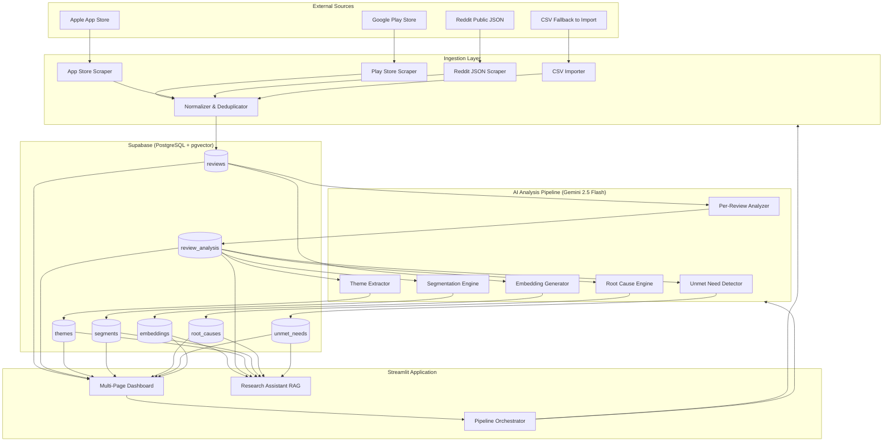
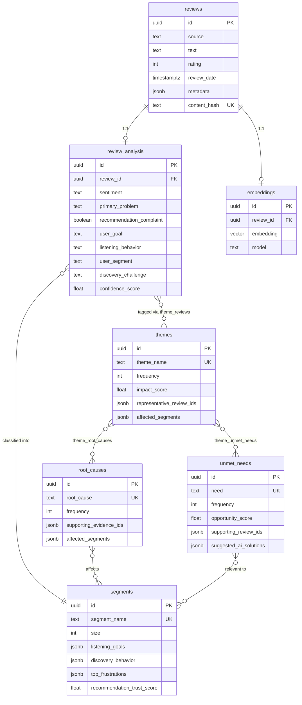
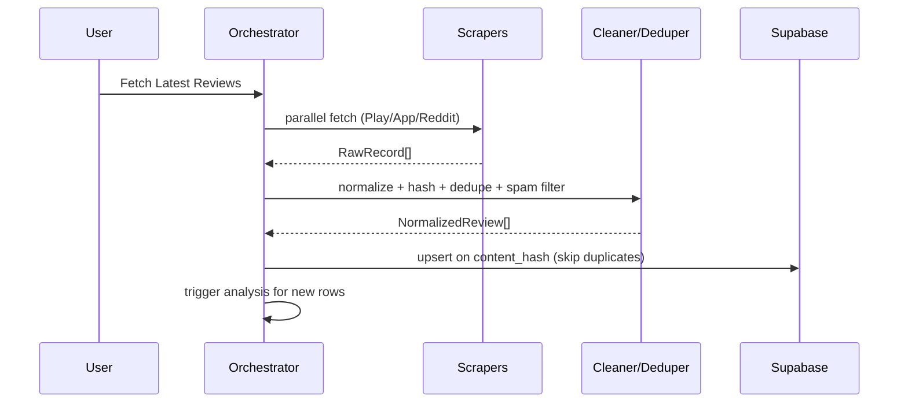
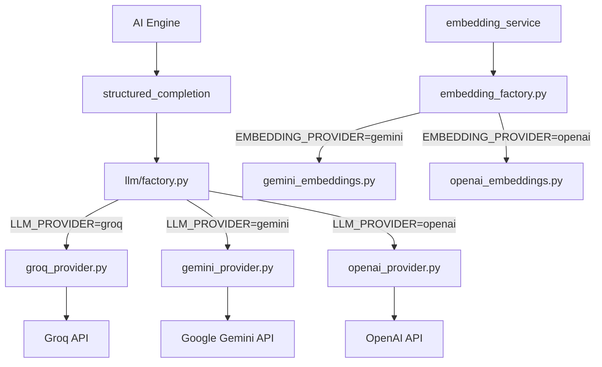
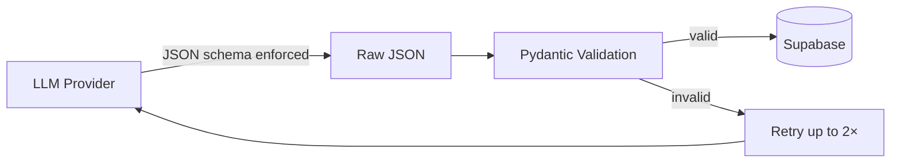
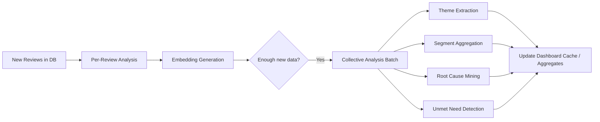
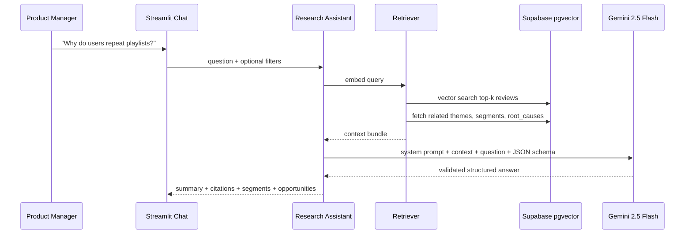
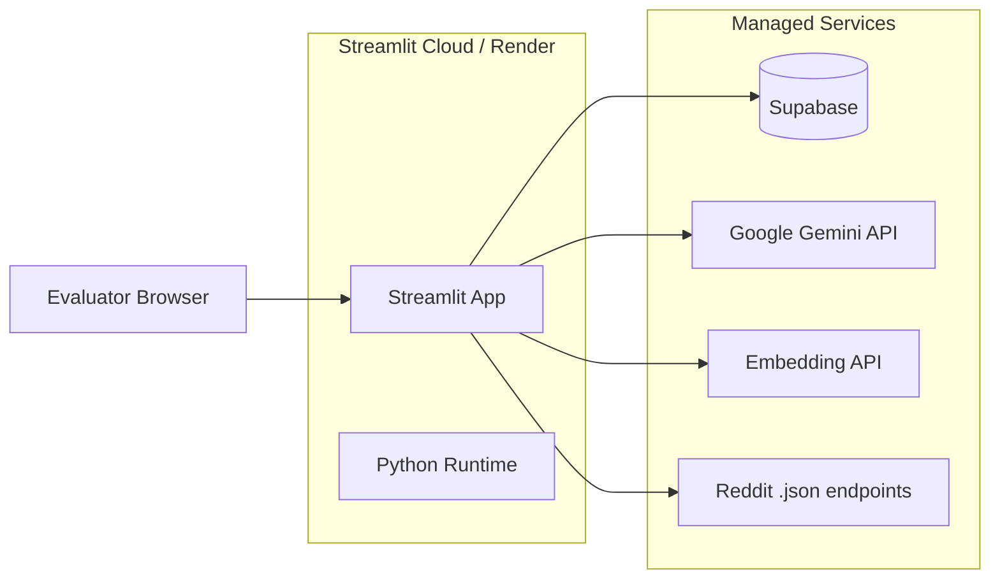

# Spotify AI-Powered Review Discovery Engine — System Architecture

## 1. Executive Summary

This document defines the architecture for a **Product Research Intelligence Platform** that automatically ingests public user feedback (Play Store, App Store, Reddit), processes and stores it in Supabase, runs multi-stage LLM analysis via **Google Gemini 2.5 Flash** (default), and exposes insights through a Streamlit dashboard and a RAG-powered Research Assistant. All AI outputs use **structured JSON schemas** validated before Supabase storage. The LLM provider is **swappable** (`gemini` | `openai`) through environment variables — no provider-specific logic in business code.

The system is designed as a **modular Python monolith** with clear service boundaries, deployable to Streamlit Cloud / Render / Railway, with CSV fallback when live scraping is unavailable.

---

## 2. Architecture Principles

| Principle | Rationale |
|-----------|-----------|
| **Pipeline over monolith logic** | Ingestion → normalize → analyze → aggregate → serve are separate stages with idempotent jobs |
| **Single source of truth** | Supabase holds raw reviews, per-review analysis, and derived aggregates |
| **Batch + incremental** | Full re-analysis on first run; incremental on "Fetch Latest Reviews" |
| **Evidence-first AI** | Every insight links to source reviews; RAG cites stored embeddings |
| **Graceful degradation** | Scrapers fail independently; CSV import uses the same downstream pipeline |
| **Structured AI outputs** | All LLM responses use JSON schemas validated by Pydantic before Supabase writes |

---

## 3. High-Level System Diagram



---

## 4. Layered Architecture

```
┌─────────────────────────────────────────────────────────────┐
│  Presentation Layer (Streamlit)                             │
│  pages/ · components/ · session state · charts              │
├─────────────────────────────────────────────────────────────┤
│  Application Layer                                          │
│  pipeline orchestrator · query services · RAG chat service  │
├─────────────────────────────────────────────────────────────┤
│  Domain / AI Layer                                          │
│  analyzers · theme/segment/root-cause engines · prompts    │
├─────────────────────────────────────────────────────────────┤
│  Data Access Layer                                          │
│  Supabase client · repositories · vector search             │
├─────────────────────────────────────────────────────────────┤
│  Ingestion Layer                                            │
│  scrapers · CSV loader describe · cleaners · deduplicators      │
└─────────────────────────────────────────────────────────────┘
```

---

## 5. Repository Structure

```
spotify-review-engine/
├── app/
│   ├── main.py                      # Streamlit entry point
│   ├── config.py                    # env vars, constants
│   └── pages/
│       ├── 01_executive_summary.py
│       ├── 02_source_analysis.py
│       ├── 11_review_discovery.py
│       ├── 03_discovery_challenges.py
│       ├── 04_theme_explorer.py
│       ├── 05_segment_explorer.py
│       ├── 06_root_cause_analysis.py
│       ├── 07_unmet_needs.py
│       ├── 08_discovery_journey.py
│       ├── 09_interview_validation.py
│       └── 10_research_assistant.py
├── src/
│   ├── ingestion/
│   │   ├── playstore_scraper.py     # google-play-scraper
│   │   ├── appstore_scraper.py      # app-store-scraper / RSS
│   │   ├── reddit_json_scraper.py   # httpx + public .json endpoints (no OAuth)
│   │   ├── csv_importer.py          # fallback mode
│   │   ├── normalizer.py            # unified schema
│   │   ├── deduplicator.py
│   │   └── cleaner.py
│   ├── llm/
│   │   ├── base.py                  # LLMProvider protocol
│   │   ├── factory.py               # create_llm_provider() from LLM_PROVIDER env
│   │   ├── groq_provider.py         # Groq (default for per-review analysis)
│   │   ├── gemini_provider.py       # Google Gemini
│   │   ├── openai_provider.py       # optional swap via LLM_PROVIDER=openai
│   │   ├── embedding_factory.py     # create_embedding_provider()
│   │   ├── gemini_embeddings.py
│   │   ├── openai_embeddings.py
│   │   └── structured.py            # provider-agnostic structured_completion()
│   ├── analysis/
│   │   ├── review_analyzer.py       # per-review classification + JSON schema
│   │   ├── theme_extractor.py       # collective theme mining
│   │   ├── segment_engine.py        # segment summaries
│   │   ├── root_cause_engine.py     # root cause + JSON schema
│   │   ├── unmet_need_detector.py   # unmet needs + JSON schema
│   │   └── embedding_service.py     # provider-agnostic embeddings → pgvector
│   ├── schemas/
│   │   ├── review_analysis.py       # Pydantic + JSON schema export
│   │   ├── themes.py
│   │   ├── segments.py
│   │   ├── root_causes.py
│   │   ├── unmet_needs.py
│   │   ├── executive_summary.py
│   │   └── research_assistant.py
│   ├── rag/
│   │   ├── retriever.py             # hybrid: vector + metadata filters
│   │   ├── context_builder.py
│   │   └── research_assistant.py    # structured JSON + citations
│   ├── pipeline/
│   │   └── orchestrator.py          # fetch → store → analyze → aggregate
│   ├── db/
│   │   ├── client.py                # Supabase client singleton
│   │   ├── models.py                # Pydantic schemas
│   │   └── repositories/
│   │       ├── reviews_repo.py
│   │       ├── analysis_repo.py
│   │       ├── themes_repo.py
│   │       ├── segments_repo.py
│   │       ├── root_causes_repo.py
│   │       ├── unmet_needs_repo.py
│   │       └── embeddings_repo.py
│   └── services/
│       ├── dashboard_service.py     # KPIs, aggregations for UI
│       ├── review_discovery_service.py  # corpus search, filters, pagination
│       ├── explorer_service.py      # theme/segment drill-down data
│       └── journey_service.py       # discovery journey path builder
├── prompts/
│   ├── review_analysis.txt
│   ├── theme_extraction.txt
│   ├── segmentation.txt
│   ├── root_cause.txt
│   ├── unmet_needs.txt
│   └── research_assistant.txt
├── supabase/
│   └── migrations/
│       └── 001_initial_schema.sql
├── data/
│   └── fallback/                    # sample CSVs for demo
├── tests/
├── docs/
│   ├── problemStatement.md
│   └── architecture.md
├── requirements.txt
├── .env.example
├── Dockerfile                       # optional: Render/Railway
└── streamlit_app.py                 # thin wrapper → app/main.py
```

---

## 6. Data Architecture

### 6.1 Canonical Review Schema

All sources normalize into a single `reviews` row:

```json
{
  "id": "uuid",
  "source": "playstore | appstore | reddit",
  "text": "normalized body text",
  "rating": 1-5 or null,
  "review_date": "ISO8601",
  "metadata": {
    "reviewer_name": "",
    "title": "",
    "subreddit": "",
    "upvotes": 0,
    "external_id": "source-native id for dedup",
    "raw": {}
  },
  "content_hash": "sha256 of normalized text",
  "created_at": "timestamp",
  "analyzed_at": "timestamp | null"
}
```

### 6.2 Entity Relationship Diagram



### 6.3 Supabase SQL (Core Tables)

```sql
-- Enable pgvector
CREATE EXTENSION IF NOT EXISTS vector;

CREATE TABLE reviews (
    id UUID PRIMARY KEY DEFAULT gen_random_uuid(),
    source TEXT NOT NULL CHECK (source IN ('playstore', 'appstore', 'reddit')),
    text TEXT NOT NULL,
    rating SMALLINT,
    review_date TIMESTAMPTZ,
    metadata JSONB DEFAULT '{}',
    content_hash TEXT UNIQUE NOT NULL,
    created_at TIMESTAMPTZ DEFAULT now(),
    analyzed_at TIMESTAMPTZ
);

CREATE TABLE review_analysis (
    id UUID PRIMARY KEY DEFAULT gen_random_uuid(),
    review_id UUID UNIQUE REFERENCES reviews(id) ON DELETE CASCADE,
    sentiment TEXT CHECK (sentiment IN ('positive', 'negative', 'neutral', 'mixed')),
    primary_problem TEXT,
    recommendation_complaint BOOLEAN DEFAULT false,
    user_goal TEXT,
    listening_behavior TEXT,
    user_segment TEXT,
    discovery_challenge TEXT,
    confidence_score REAL,
    created_at TIMESTAMPTZ DEFAULT now()
);

CREATE TABLE themes (
    id UUID PRIMARY KEY DEFAULT gen_random_uuid(),
    theme_name TEXT UNIQUE NOT NULL,
    frequency INT DEFAULT 0,
    impact_score REAL,
    representative_review_ids UUID[] DEFAULT '{}',
    affected_segments TEXT[] DEFAULT '{}',
    updated_at TIMESTAMPTZ DEFAULT now()
);

CREATE TABLE segments (
    id UUID PRIMARY KEY DEFAULT gen_random_uuid(),
    segment_name TEXT UNIQUE NOT NULL,
    size INT DEFAULT 0,
    listening_goals JSONB DEFAULT '[]',
    discovery_behavior JSONB DEFAULT '[]',
    top_frustrations JSONB DEFAULT '[]',
    recommendation_trust_score REAL,
    updated_at TIMESTAMPTZ DEFAULT now()
);

CREATE TABLE root_causes (
    id UUID PRIMARY KEY DEFAULT gen_random_uuid(),
    root_cause TEXT UNIQUE NOT NULL,
    frequency INT DEFAULT 0,
    supporting_evidence_ids UUID[] DEFAULT '{}',
    affected_segments TEXT[] DEFAULT '{}',
    updated_at TIMESTAMPTZ DEFAULT now()
);

CREATE TABLE unmet_needs (
    id UUID PRIMARY KEY DEFAULT gen_random_uuid(),
    need TEXT UNIQUE NOT NULL,
    frequency INT DEFAULT 0,
    opportunity_score REAL,
    supporting_review_ids UUID[] DEFAULT '{}',
    suggested_ai_solutions JSONB DEFAULT '[]',
    updated_at TIMESTAMPTZ DEFAULT now()
);

CREATE TABLE embeddings (
    id UUID PRIMARY KEY DEFAULT gen_random_uuid(),
    review_id UUID UNIQUE REFERENCES reviews(id) ON DELETE CASCADE,
    embedding vector(768),  -- Gemini text-embedding-004 default; set EMBEDDING_DIMENSIONS
    model TEXT NOT NULL,
    created_at TIMESTAMPTZ DEFAULT now()
);

-- Junction tables for drill-down queries
CREATE TABLE theme_reviews (
    theme_id UUID REFERENCES themes(id) ON DELETE CASCADE,
    review_id UUID REFERENCES reviews(id) ON DELETE CASCADE,
    PRIMARY KEY (theme_id, review_id)
);

CREATE INDEX idx_reviews_source ON reviews(source);
CREATE INDEX idx_reviews_analyzed ON reviews(analyzed_at);
CREATE INDEX idx_analysis_segment ON review_analysis(user_segment);
CREATE INDEX idx_embeddings_vector ON embeddings
    USING ivfflat (embedding vector_cosine_ops) WITH (lists = 100);
```

### 6.4 Interview Validation (Future — Dashboard 9)

```sql
CREATE TABLE interview_insights (
    id UUID PRIMARY KEY DEFAULT gen_random_uuid(),
    insight TEXT NOT NULL,
    linked_theme_id UUID REFERENCES themes(id),
    validation_pct REAL,
    confidence_score REAL,
    notes TEXT,
    created_at TIMESTAMPTZ DEFAULT now()
);
```

---

## 7. Ingestion Architecture

### 7.1 Source Adapters

Each scraper implements a common interface:

```python
class SourceAdapter(Protocol):
    def fetch(self, config: IngestConfig) -> list[RawRecord]: ...
    def source_name(self) -> str: ...
```

| Source | Library | Collection Strategy | Target |
|--------|---------|---------------------|--------|
| Play Store | `google-play-scraper` | Latest, top, keyword-filtered (recommendations, playlists, discovery, shuffle) | 500+ |
| App Store | `app-store-scraper` or RSS | Recent, high-engagement, keyword-filtered | 300+ |
| Reddit | `httpx` (public `.json` API) | Multi-subreddit search + hot posts + comments; 6–10s delay between requests; no OAuth | 200+ posts/comments |

### 7.1.1 Reddit JSON Scraper Details

Reddit ingestion uses **public read-only JSON endpoints** — no Reddit app or OAuth credentials.

```text
GET https://www.reddit.com/r/{subreddit}/search.json?q={term}&restrict_sr=on&limit=100
GET https://www.reddit.com/r/{subreddit}/hot.json?limit=100
GET https://www.reddit.com/r/{subreddit}/comments/{post_id}.json
Header: User-Agent: spotify-review-engine/1.0 (contact: your@email.com)
```

| Config | Purpose |
|--------|---------|
| `REDDIT_USER_AGENT` | Required on every request (Reddit rejects default/empty agents) |
| `REDDIT_REQUEST_DELAY_SECONDS` | Delay between requests (default: 7) to avoid 429 |
| Fallback | On 429/403 → import `data/fallback/reddit_sample.csv` |

Subreddits: `spotify`, `truespotify`, `music`, `listentothis`. Eight search terms from problemStatement §Source 3.

---

### 7.2 Processing Pipeline



### 7.3 Deduplication Strategy

1. **Primary key**: `content_hash = sha256(normalized_text + source)`
2. **Reddit-specific**: also dedupe by `metadata.external_id` (comment/post id)
3. **Near-duplicate** (optional v2): embedding cosine similarity > 0.95 within same source
4. **Spam filter**: min length, URL-only, repeated character patterns

### 7.4 CSV Fallback Mode

When scraping fails (rate limits, API restrictions):

```
User uploads CSV → csv_importer maps columns → same normalizer → same DB upsert → same AI pipeline
```

No code path changes downstream. UI shows source badge as `playstore|appstore|reddit` from CSV column.

---

## 8. AI Analysis Pipeline

### 8.0 LLM Provider Abstraction & Structured Outputs

The platform uses **Google Gemini 2.5 Flash** as the default LLM for all generative tasks. Provider selection is controlled entirely by environment variables — business logic never imports provider SDKs directly.

#### Primary Model (Default)

| Task | Model | Env Var |
|------|-------|---------|
| Per-review analysis & classification | **Gemini 2.5 Flash** | `GEMINI_MODEL` |
| Sentiment analysis | **Gemini 2.5 Flash** | `GEMINI_MODEL` |
| Theme extraction | **Gemini 2.5 Flash** | `GEMINI_MODEL` |
| User segmentation summaries | **Gemini 2.5 Flash** | `GEMINI_MODEL` |
| Root cause analysis | **Gemini 2.5 Flash** | `GEMINI_MODEL` |
| Unmet need detection | **Gemini 2.5 Flash** | `GEMINI_MODEL` |
| Executive summary | **Gemini 2.5 Flash** | `GEMINI_MODEL` |
| Research Assistant (RAG) | **Gemini 2.5 Flash** | `GEMINI_MODEL` |
| Embeddings (default) | **text-embedding-004** | `GEMINI_EMBEDDING_MODEL` |

Default: `GROQ_MODEL=llama-3.3-70b-versatile` (analysis) · `GEMINI_EMBEDDING_MODEL=gemini-embedding-001` (embeddings)

#### Provider Swap Architecture



**Environment-driven provider selection:**

| Env Var | Values | Default | Purpose |
|---------|--------|---------|---------|
| `LLM_PROVIDER` | `groq` \| `gemini` \| `openai` | `groq` | Generative LLM backend |
| `GROQ_API_KEY` | string | — | Required when `LLM_PROVIDER=groq` |
| `GROQ_MODEL` | string | `llama-3.3-70b-versatile` | Model when using Groq provider |
| `GEMINI_API_KEY` | string | — | Required when `LLM_PROVIDER=gemini` or `EMBEDDING_PROVIDER=gemini` |
| `GEMINI_MODEL` | string | `gemini-2.5-flash` | Model for generative tasks when using Gemini |
| `OPENAI_API_KEY` | string | — | Required when `LLM_PROVIDER=openai` |
| `OPENAI_MODEL` | string | `gpt-4o` | Model when using OpenAI provider |
| `EMBEDDING_PROVIDER` | `gemini` \| `openai` | `gemini` | Embedding backend |
| `GEMINI_EMBEDDING_MODEL` | string | `gemini-embedding-001` | Gemini embeddings |
| `OPENAI_EMBEDDING_MODEL` | string | `text-embedding-3-small` | OpenAI embeddings |
| `EMBEDDING_DIMENSIONS` | int | `768` | pgvector column size (768 Gemini / 1536 OpenAI) |

**Swap example — switch to OpenAI without code changes:**

```env
LLM_PROVIDER=openai
OPENAI_API_KEY=sk-...
OPENAI_MODEL=gpt-4o
EMBEDDING_PROVIDER=openai
OPENAI_EMBEDDING_MODEL=text-embedding-3-small
EMBEDDING_DIMENSIONS=1536
```

#### LLMProvider Protocol

```python
class LLMProvider(Protocol):
    def structured_completion(
        self,
        system_prompt: str,
        user_content: str,
        schema_model: type[BaseModel],
    ) -> BaseModel: ...
```

All AI engines call `src/llm/structured.py` → `structured_completion()` which delegates to the active provider. **No engine imports `google.genai` or `openai` directly.**

#### Structured JSON Requirement

**All AI outputs must use structured JSON schemas** — no free-form text parsed downstream.



**Implementation pattern (every AI engine):**

1. Define output shape in `src/schemas/{task}.py` as a Pydantic model
2. Export JSON schema via `model.model_json_schema()`
3. Pass schema to provider:
   - **Gemini**: `response_mime_type="application/json"` + `response_schema`
   - **OpenAI** (swap): `response_format={"type": "json_schema", ...}`
4. Parse response with `Model.model_validate_json(response)`
5. Map validated model → repository insert/upsert
6. On validation failure: log error, retry with same schema (max 2 retries)

**Schema files:**

| Engine | Schema module | Stored in |
|--------|---------------|-----------|
| Per-review analyzer | `schemas/review_analysis.py` | `review_analysis` |
| Theme extractor | `schemas/themes.py` | `themes` + `theme_reviews` |
| Segment engine | `schemas/segments.py` | `segments` |
| Root cause engine | `schemas/root_causes.py` | `root_causes` |
| Unmet need detector | `schemas/unmet_needs.py` | `unmet_needs` |
| Executive summary | `schemas/executive_summary.py` | cached / session |
| Research Assistant | `schemas/research_assistant.py` | returned to UI (not persisted as row) |

**Shared helper** (`src/llm/structured.py`):

```python
def structured_completion(
    system_prompt: str,
    user_content: str,
    schema_model: type[BaseModel],
) -> BaseModel:
    """Provider-agnostic structured LLM call; validates with Pydantic."""
    provider = create_llm_provider()  # reads LLM_PROVIDER env
    return provider.structured_completion(system_prompt, user_content, schema_model)
```

Deterministic post-processing (impact scores, opportunity scores, frequency counts) runs **after** JSON validation — never inside the LLM response.

### 8.1 Pipeline Stages



### 8.2 Stage 1 — Per-Review Analysis

- **Model**: `llama-3.3-70b-versatile` via `LLM_PROVIDER=groq` (default), swappable to Gemini or OpenAI
- **Input**: single review text + source + rating
- **Output**: validated JSON → `review_analysis` (via `schemas/review_analysis.py`)
- **Batching**: process in chunks of 10–20 with rate-limit backoff
- **Idempotency**: skip reviews where `analyzed_at IS NOT NULL`
- **Prompt design**: structured JSON schema enforced by provider; segment enums in Pydantic schema

Extracted fields:

| Field | Type | Purpose |
|-------|------|---------|
| sentiment | enum | Dashboard sentiment charts |
| primary_problem | text | Complaint taxonomy |
| recommendation_complaint | bool | Recommendation-specific KPIs |
| user_goal | text | Journey analysis |
| listening_behavior | text | Segmentation input |
| user_segment | enum | Casual / Playlist-Dependent / Explorer / Genre Loyalist / Power User |
| discovery_challenge | text | Theme clustering seed |
| confidence_score | 0–1 | Filter low-confidence in RAG |

### 8.3 Stage 2 — Embedding Generation

- **Provider**: `EMBEDDING_PROVIDER=gemini` (default) or `openai` (swap)
- **Default model**: `text-embedding-004` (768 dims)
- **Swap model**: `text-embedding-3-small` (1536 dims) when `EMBEDDING_PROVIDER=openai`
- Store in `embeddings` with pgvector index sized to `EMBEDDING_DIMENSIONS`
- Used by Research Assistant RAG and optional near-dedup

### 8.4 Stage 3 — Collective Analysis

Runs after per-review analysis completes (or on schedule). Operates on **aggregated statistics + representative samples**, not all 1000+ reviews in one prompt. All engines return **schema-validated JSON** before DB writes.

| Engine | Input | Output Table | Method |
|--------|-------|--------------|--------|
| Theme Extractor | Top discovery_challenge + primary_problem freq + 50 sample reviews | `themes` | Gemini structured JSON + frequency counts from DB |
| Segmentation Engine | Group by `user_segment`, aggregate behaviors/frustrations | `segments` | SQL aggregation + Gemini JSON summary per segment |
| Root Cause Engine | Cross-theme patterns + negative sentiment cluster | `root_causes` | Gemini causal reasoning with evidence IDs |
| Unmet Need Detector | Gap analysis between user_goal and discovery_challenge | `unmet_needs` | Gemini + opportunity scoring rubric |

**Impact / opportunity scoring rubric** (deterministic post-processing):

```
impact_score = (frequency × avg_negative_sentiment × rec_complaint_rate) normalized 0–100
opportunity_score = (frequency × severity × segment_breadth) normalized 0–100
```

### 8.5 Cost & Latency Controls

| Control | Implementation |
|---------|----------------|
| Incremental analysis | Only unanalyzed reviews |
| Collective re-run threshold | Re-run theme/root-cause when ≥50 new reviews or manual refresh |
| Caching | Store LLM outputs in DB; dashboard reads DB not LLM |
| Token budgeting | Truncate long Reddit threads; sample representative reviews per theme |
| Provider swap | Change `LLM_PROVIDER` / `EMBEDDING_PROVIDER` env vars — no code changes |
| Schema validation | Pydantic rejects malformed LLM output before any DB write |

---

## 9. RAG Research Assistant Architecture

### 9.1 Retrieval Flow



### 9.2 Hybrid Retrieval Strategy

1. **Vector search**: top 15 review chunks from `embeddings`
2. **Structured lookup**: filter `review_analysis` by keywords / segment / recommendation_complaint
3. **Aggregate context**: inject current `themes`, `root_causes`, `unmet_needs` summaries
4. **Citation format**: `[Review #id | source | date | rating]` with expandable text in UI

### 9.3 Response Schema

Returned by Gemini and validated via `schemas/research_assistant.py` before rendering in UI:

```json
{
  "summary": "",
  "key_themes": [],
  "root_causes": [],
  "affected_segments": [],
  "supporting_evidence": [
    { "review_id": "", "excerpt": "", "source": "", "rating": null }
  ],
  "product_opportunities": [],
  "confidence": 0.0
}
```

---

## 10. Dashboard Architecture

### 10.1 Streamlit Multi-Page App

| Page | Data Sources | Key Visualizations |
|------|--------------|-------------------|
| Executive Summary | Aggregates across all tables | KPI cards, Gemini AI exec summary (JSON → markdown), trust score gauge |
| Source Analysis | `reviews` + `review_analysis` by source | Bar charts, sentiment stacked bars, complaint word cloud |
| Review Discovery | `reviews` (paginated search) | Keyword search, rating/source filters, rating distribution bars, review cards |
| Discovery Challenges | `themes` | Ranked table with impact badges |
| Theme Explorer | `themes` + `theme_reviews` + joins | Drill-down panel, segment pie, related links |
| Segment Explorer | `segments` + filtered `review_analysis` | Segment cards, frustration lists |
| Root Cause Analysis | `root_causes` | Evidence timeline, segment heatmap |
| Unmet Needs | `unmet_needs` | Opportunity matrix, AI solution cards |
| Discovery Journey | `review_analysis` user_goal chains | Horizontal path bar chart, stage table, step detail |
| Interview Validation | `interview_insights` (future) | Comparison table |
| Research Assistant | RAG service (Gemini, schema-validated JSON) | Chat UI with citation sidebar |

### 10.2 Global Actions (Sidebar)

- **Fetch Latest Reviews** → triggers `PipelineOrchestrator.run_full_pipeline()`
- **Import CSV (Fallback)** → file uploader → `csv_importer`
- **Re-run Collective Analysis** → theme/segment/root-cause/unmet-need engines
- **Pipeline status** → progress bar, last run timestamp, counts

### 10.3 UI Component Library

Reuse Streamlit + Plotly/Altair components:

- `components/kpi_card.py`
- `components/sentiment_chart.py`
- `components/evidence_list.py`
- `components/segment_badge.py`
- `components/rating_distribution_chart.py`
- `components/review_card.py`
- `components/journey_flow_chart.py`

---

## 11. Pipeline Orchestrator

Central coordinator invoked by "Fetch Latest Reviews":

```python
class PipelineOrchestrator:
    async def run_full_pipeline(self) -> PipelineResult:
        # 1. Ingest (parallel scrapers, catch failures per source)
        raw = await self.ingest_all()
        # 2. Normalize, dedupe, persist
        new_ids = self.persist_reviews(raw)
        # 3. Per-review AI analysis (batch)
        self.analyze_reviews(new_ids)
        # 4. Embeddings for new reviews
        self.generate_embeddings(new_ids)
        # 5. Collective analysis if threshold met
        if self.should_run_collective():
            self.run_collective_analysis()
        # 6. Return stats for UI toast
        return PipelineResult(...)
```

**State tracking**: store last pipeline run in a `pipeline_runs` table or Supabase metadata row.

---

## 12. Configuration & Secrets

```env
# .env.example
SUPABASE_URL=
SUPABASE_SERVICE_KEY=

# LLM provider (default: groq for analysis)
LLM_PROVIDER=groq
GROQ_API_KEY=
GROQ_MODEL=llama-3.3-70b-versatile

# Gemini (embeddings default; or set LLM_PROVIDER=gemini)
GEMINI_API_KEY=
GEMINI_MODEL=gemini-2.5-flash

# Optional — only when LLM_PROVIDER=openai
# OPENAI_API_KEY=
# OPENAI_MODEL=gpt-4o

# Embeddings (default: gemini — recommended with LLM_PROVIDER=groq)
EMBEDDING_PROVIDER=gemini
GEMINI_EMBEDDING_MODEL=gemini-embedding-001
EMBEDDING_DIMENSIONS=768

# Optional — only when EMBEDDING_PROVIDER=openai
# OPENAI_EMBEDDING_MODEL=text-embedding-3-small
# EMBEDDING_DIMENSIONS=1536

REDDIT_USER_AGENT=spotify-review-engine/1.0 (contact: your@email.com)
REDDIT_REQUEST_DELAY_SECONDS=7
SPOTIFY_PLAY_STORE_APP_ID=com.spotify.music
SPOTIFY_APP_STORE_APP_ID=324684580
MIN_REVIEWS_PLAYSTORE=500
MIN_REVIEWS_APPSTORE=300
MIN_REVIEWS_REDDIT=200
```

Use `pydantic-settings` for typed config. Never commit `.env`.

---

## 13. Deployment Architecture



| Platform | Notes |
|----------|-------|
| **Streamlit Cloud** | Primary target; connect GitHub repo; set secrets in dashboard |
| **Render / Railway** | Dockerfile with `streamlit run streamlit_app.py --server.port=$PORT` |
| **Scheduled ingestion** (optional) | Render cron or GitHub Actions calling pipeline script |

### 13.1 Production Checklist

- [ ] Supabase RLS policies (service key server-side only)
- [ ] Rate limiting on LLM API calls (Gemini / OpenAI)
- [ ] Scraper timeout + partial success handling
- [ ] Sample fallback CSVs bundled for offline demo
- [ ] `requirements.txt` pinned versions
- [ ] Health indicator on Executive Summary (DB connected, last pipeline run)

---

## 14. Error Handling & Observability

| Failure | Behavior |
|---------|----------|
| Play Store scrape fails | Log warning; continue with App Store + Reddit; offer CSV upload |
| Reddit JSON 429/403 | Retry 3× with backoff; fall back to bundled CSV; continue other sources |
| LLM rate limit (Gemini/OpenAI) | Exponential backoff; resume from last unanalyzed review |
| Supabase unavailable | UI error banner; disable fetch/analyze |
| Partial analysis | Dashboard shows "N of M analyzed"; assistant notes data freshness |

Log to stdout (Streamlit Cloud captures). Optional: structured JSON logs for pipeline stages.

---

## 15. Security Considerations

- **Service role key** used only in backend modules, never exposed to browser
- **Reddit User-Agent** set via env var; no OAuth secrets required
- **No PII enrichment** — store only public review data
- **Input sanitization** on CSV upload (size limits, column validation)
- **Prompt injection mitigation** in RAG: treat review text as untrusted data, not instructions

---

## 16. Phased Implementation Roadmap

### Phase 1 — Foundation (Week 1)
- Supabase schema + repositories
- Normalizer, deduplicator, CSV importer
- Play Store scraper (highest volume)
- Per-review analyzer + embeddings
- Basic Executive Summary dashboard

### Phase 2 — Full Ingestion (Week 2)
- App Store + Reddit JSON scraper
- Source Analysis + Discovery Challenges dashboards
- Pipeline orchestrator with "Fetch Latest Reviews"

### Phase 3 — Collective Intelligence (Week 3)
- Theme, segment, root cause, unmet need engines
- Theme Explorer, Segment Explorer, Root Cause, Unmet Needs dashboards
- Discovery Journey visualization

### Phase 4 — RAG Assistant & Polish (Week 4)
- Research Assistant with exit with citations
- Interview Validation scaffold (manual entry)
- Deployment, fallback CSVs, demo script
- Executive AI summary generation

---

## 17. Key Design Decisions

| Decision | Choice | Alternatives Considered |
|----------|--------|-------------------------|
| Frontend | Streamlit | FastAPI + React (more work for case study timeline) |
| Architecture style | Modular monolith | Microservices (overkill for demo scale) |
| DB | Supabase + pgvector | Pinecone + Postgres split (unnecessary complexity) |
| LLM provider | **Gemini 2.5 Flash** (default), swappable via `LLM_PROVIDER` | Hardcoded single provider |
| LLM abstraction | `src/llm/` provider factory | Direct SDK calls in engines |
| AI output format | Structured JSON schemas + Pydantic validation | Free-form text parsing (fragile, inconsistent) |
| Collective analysis | Batch LLM on aggregates | Pure embedding clustering (less interpretable for PM audience) |
| Scraping | Direct Python libraries (`google-play-scraper`, `httpx` for Reddit JSON) | n8n / PRAW (not used — Reddit app not required) |
| State | Supabase as SoT | In-memory/session (not persistent across deploys) |

---

## 18. Success Metrics (Platform Health)

| Metric | Target |
|--------|--------|
| Total reviews ingested | 1000+ (500 Play + 300 App + 200 Reddit) |
| Analysis coverage | ≥95% of reviews analyzed |
| Dashboard load time | <3s for aggregate pages |
| RAG citation rate | ≥3 evidence items per strategic question |
| Pipeline end-to-end | <15 min for full fetch + analyze (excluding first-time 1000 review batch) |
| Fallback demo | Fully functional from CSV with zero scraper dependency |

---

## 19. Extension Points (Parts 2–4 of Case Study)

| Future Need | Architecture Hook |
|-------------|-------------------|
| User interview validation | `interview_insights` table + Dashboard 9 comparison logic |
| Problem definition export | PDF/Markdown generator from themes + root causes |
| MVP hypothesis tracking | `product_opportunities` table linked to unmet needs |
| A/B insight tracking | `pipeline_runs` versioning for trend detection |
| n8n automation | Webhook endpoint or scheduled script trigger for orchestrator |

---

*This architecture satisfies all requirements in `problemStatement.md` and provides a clear, implementable blueprint for a deployable Product Research Intelligence Platform.*
