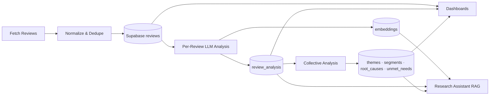

# How It Works

This document explains how the **Spotify Review Discovery Engine** (also branded as **Spotify Review Analyzer** in the UI) operates end to end — from ingesting public feedback to surfacing product research insights in dashboards and the AI Research Assistant.

For deeper technical detail, see [architecture.md](./architecture.md). For setup and deployment, see [deployment.md](./deployment.md).

---

## 1. What the system does

The platform is a **product research intelligence tool** for Spotify music-discovery feedback. It:

1. **Collects** public reviews and discussions from Google Play, Apple App Store, and Reddit.
2. **Stores** normalized reviews in Supabase (PostgreSQL).
3. **Analyzes** each review with an LLM (Groq by default) to extract sentiment, user goals, discovery challenges, and user segment.
4. **Embeds** review text with Gemini (default) into pgvector for semantic search.
5. **Aggregates** analyzed reviews into themes, segments, root causes, and unmet needs.
6. **Visualizes** insights across Streamlit dashboards.
7. **Answers questions** via a RAG-powered Research Assistant with cited evidence.

The design goal is **evidence-first research**: every aggregate insight can be traced back to real review text.

---

## 2. High-level flow



**Typical user workflow:**

1. Click **Fetch Latest Reviews** (or fetch a single source).
2. Reviews are scraped, cleaned, deduplicated, and stored.
3. New reviews are analyzed by the LLM and embedded.
4. When enough analyzed reviews exist, collective engines run (themes, segments, etc.).
5. Dashboard pages refresh to show updated KPIs, charts, and drill-downs.
6. Ask the Research Assistant questions about discovery pain points and opportunities.

---

## 3. Application entry point

| File | Role |
|------|------|
| `streamlit_app.py` | Thin wrapper; loads secrets and calls `app.main` |
| `app/main.py` | Streamlit config, sidebar pipeline actions, page navigation |
| `app/pages/*.py` | Individual dashboard screens |
| `app/components/*.py` | Reusable UI (KPI cards, charts, panels) |
| `src/services/*.py` | Query/aggregation logic for dashboards |
| `src/pipeline/orchestrator.py` | Coordinates ingest → analyze → collective analysis |

On startup, `src/deploy/secrets.py` bridges environment variables and Streamlit Cloud Secrets into app settings.

---

## 4. Data ingestion

### Sources

| Source | Method | Notes |
|--------|--------|-------|
| **Play Store** | `google-play-scraper` | Live scrape of Spotify app reviews |
| **App Store** | iTunes RSS / optional library | Multi-region fetch with offline fallback files |
| **Reddit** | Public JSON endpoints | No OAuth; rate limits may trigger automatic CSV fallback internally |

### Ingestion pipeline

1. **Scrape or load** raw records per source adapter (`src/ingestion/`).
2. **Normalize** to a canonical schema: `source`, `text`, `rating`, `review_date`, `metadata`.
3. **Deduplicate** using a `content_hash` (hash of normalized text + source).
4. **Upsert** into the `reviews` table via `ReviewsRepository`.

Scrapers are **independent** — if one source fails, others can still succeed (partial pipeline status is shown in the sidebar).

### Sidebar actions

| Action | What it does |
|--------|----------------|
| **Fetch Latest Reviews** | Parallel ingest from all three sources, then analyze/embed new reviews |
| **Fetch Play Store / App Store / Reddit** | Single-source ingest |
| **Fetch All Store Reviews** | Play + App Store only |
| **Run Analysis** | LLM analysis + embeddings for unanalyzed reviews (respects max limit) |
| **Re-run Collective Analysis** | Rebuilds themes, segments, root causes, unmet needs |

Pipeline runs are logged in the `pipeline_runs` table with status and stats.

---

## 5. Database model (Supabase)

Core tables (see `supabase/migrations/001_initial_schema.sql`):

| Table | Purpose |
|-------|---------|
| `reviews` | Raw ingested review text, rating, source, metadata |
| `review_analysis` | Per-review LLM output (sentiment, segment, discovery challenge, etc.) |
| `embeddings` | Vector embeddings (768-dim) for RAG retrieval |
| `themes` | Collective discovery themes with frequency and impact |
| `segments` | User segment profiles (goals, behaviors, frustrations, trust score) |
| `root_causes` | Underlying causes linked to evidence and segments |
| `unmet_needs` | Product opportunities with suggested AI solutions |
| `pipeline_runs` | Audit log of ingest/analysis runs |
| `interview_insights` | Optional interview validation data (migration 002) |

**Deduplication:** `reviews.content_hash` is unique — re-fetching the same review does not create duplicates.

**Analysis tracking:** `reviews.analyzed_at` is set when per-review analysis completes.

---

## 6. Per-review AI analysis

When you click **Run Analysis** (or when the full pipeline runs automatically):

1. `ReviewsRepository.get_unanalyzed()` fetches reviews without `analyzed_at`.
2. For each review, `ReviewAnalyzer` sends the text to the configured LLM with a structured JSON schema (`src/schemas/review_analysis.py`).
3. The LLM returns fields such as:
   - `sentiment` (positive / negative / neutral / mixed)
   - `primary_problem`
   - `recommendation_complaint`
   - `user_goal`, `listening_behavior`
   - `user_segment` (one of five predefined segments)
   - `discovery_challenge`
   - `confidence_score`
4. Results are validated by Pydantic and stored in `review_analysis`.
5. `EmbeddingService` generates a vector and stores it in `embeddings`.

**Default providers:**

- **LLM:** Groq (`llama-3.3-70b-versatile`) — swappable via `LLM_PROVIDER`
- **Embeddings:** Google Gemini (`gemini-embedding-001`)

All LLM calls go through `src/llm/structured.py` so provider logic stays isolated from business code.

---

## 7. Collective intelligence

After enough reviews are analyzed (threshold: `COLLECTIVE_ANALYSIS_THRESHOLD`, default 10), collective engines summarize patterns across the corpus:

| Engine | Output table | What it produces |
|--------|--------------|------------------|
| **Theme Extractor** | `themes` | Named themes, frequency, impact score, affected segments |
| **Segment Engine** | `segments` | Profiles for Casual Listener, Music Explorer, etc. |
| **Root Cause Engine** | `root_causes` | Systemic causes with supporting evidence IDs |
| **Unmet Need Detector** | `unmet_needs` | Opportunities and suggested product directions |

Each engine:

1. Aggregates statistics from `review_analysis` rows.
2. Sends summaries to the LLM with a strict JSON schema.
3. Validates output and upserts into Supabase.

**Re-run Collective Analysis** in the sidebar forces a fresh pass — useful after analyzing a large batch of new reviews.

---

## 8. Dashboard pages

Navigation is defined in `app/main.py`. Each page reads from `src/services/` and renders via `app/components/`.

| Page | What you see | Primary data |
|------|--------------|--------------|
| **Executive Summary** | Portfolio KPIs, AI executive summary, segment priority, sentiment, trust | Aggregates + LLM summary |
| **Source Analysis** | Review volume and sentiment by Play / App / Reddit | `reviews` + `review_analysis` |
| **Review Discovery** | Search, filter, and browse raw review cards | `reviews` (paginated) |
| **Discovery Challenges** | Ranked discovery challenges / themes | `themes` or interim `review_analysis` |
| **Theme Explorer** | Drill into a theme, evidence, related insights | `themes` + joins |
| **Segment Explorer** | Segment cards, goals, frustrations, trust gauges | `segments` |
| **Root Cause Analysis** | Ranked root causes with evidence | `root_causes` |
| **Unmet Needs** | Opportunity matrix and AI solution ideas | `unmet_needs` |
| **Discovery Journey** | Top user paths from goal → workaround → outcome | `review_analysis` chains |
| **Interview Validation** | Compare interview notes to review insights | `interview_insights` |

### Segment Priority (Executive Summary)

The **Segment Priority** panel ranks user segments by:

```text
priority score = segment size × (negative % + rec-complaint %)
```

The top segment with sufficient sample size is highlighted as the recommended product focus. This helps prioritize which listener group to address first (e.g. Music Explorer vs Casual Listener).

### Research Assistant (FAB)

A floating **Research Assistant** button opens a chat panel (not a separate nav page). It uses RAG:

1. **Retrieve** relevant reviews via vector search + metadata filters.
2. **Build context** from retrieved reviews, themes, segments, and root causes.
3. **Generate** a structured answer with supporting evidence citations.
4. **Guardrails** block out-of-scope questions and answers without evidence.

---

## 9. Configuration

Required secrets (`.env` locally, Streamlit Secrets on Cloud):

| Variable | Purpose |
|----------|---------|
| `SUPABASE_URL` | Supabase project URL |
| `SUPABASE_SERVICE_KEY` | Database access |
| `GROQ_API_KEY` | Default LLM for analysis |
| `GEMINI_API_KEY` | Default embeddings (and optional LLM) |
| `REDDIT_USER_AGENT` | Reddit scraper identification |

See `.env.example` and `.streamlit/secrets.toml.example` for the full list.

---

## 10. Project layout (quick reference)

```text
app/                     Streamlit UI
  main.py                  Sidebar + navigation
  pages/                   Dashboard screens
  components/              Charts, KPI cards, panels
  styles/theme.css         Dark Spotify-aligned theme

src/
  ingestion/               Scrapers, normalizer, deduplicator
  analysis/                Per-review + collective AI engines
  db/                      Supabase client and repositories
  llm/                     Provider-agnostic LLM + embeddings
  rag/                     Retriever, context builder, assistant
  pipeline/                Orchestrator
  services/                Dashboard query services
  schemas/                 Pydantic models for AI outputs
  deploy/                  Secrets bootstrap, smoke tests

prompts/                   LLM system prompts
supabase/migrations/       SQL schema
tests/                     Unit and integration tests
data/fallback/             Offline CSV samples (internal fallback)
```

---

## 11. Running locally

```powershell
python -m venv .venv
.venv\Scripts\activate
pip install -r requirements.txt

copy .env.example .env
# Fill in Supabase + API keys

# Apply schema in Supabase SQL Editor:
# supabase/migrations/001_initial_schema.sql
# supabase/migrations/002_interview_validation.sql

streamlit run streamlit_app.py
```

Then use the sidebar to fetch reviews, run analysis, and explore dashboards.

---

## 12. Deployment

The app is deployed as a standard Streamlit application (Streamlit Cloud, Docker, etc.). Secrets must be configured before the database and AI features work. See [deployment.md](./deployment.md) for Streamlit Cloud Secrets format and reboot steps.

---

## 13. Design principles

| Principle | How it shows up |
|-----------|-----------------|
| **Evidence-first** | Themes, segments, and assistant answers link to real reviews |
| **Structured AI** | All LLM outputs use JSON schemas validated before DB writes |
| **Incremental pipeline** | Only new reviews are analyzed on each run |
| **Graceful degradation** | Partial source failures; internal CSV fallback for scrapers |
| **Provider swap** | Change `LLM_PROVIDER` / `EMBEDDING_PROVIDER` without code changes |
| **Idempotent ingest** | Content-hash deduplication prevents duplicate reviews |

---

## 14. Related documentation

| Document | Contents |
|----------|----------|
| [problemStatement.md](./problemStatement.md) | Original product requirements |
| [architecture.md](./architecture.md) | Detailed system architecture |
| [implementation-plan.md](./implementation-plan.md) | Phase-wise build plan |
| [deployment.md](./deployment.md) | Streamlit Cloud and Docker deployment |
| [UI guidelines.md](./UI%20guidelines.md) | Stitch design references |

---

*Last updated to reflect the current codebase: multi-page Streamlit app, Review Discovery page, Segment Priority panel, and sidebar without manual CSV upload.*
