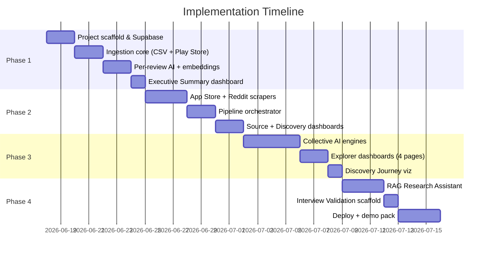
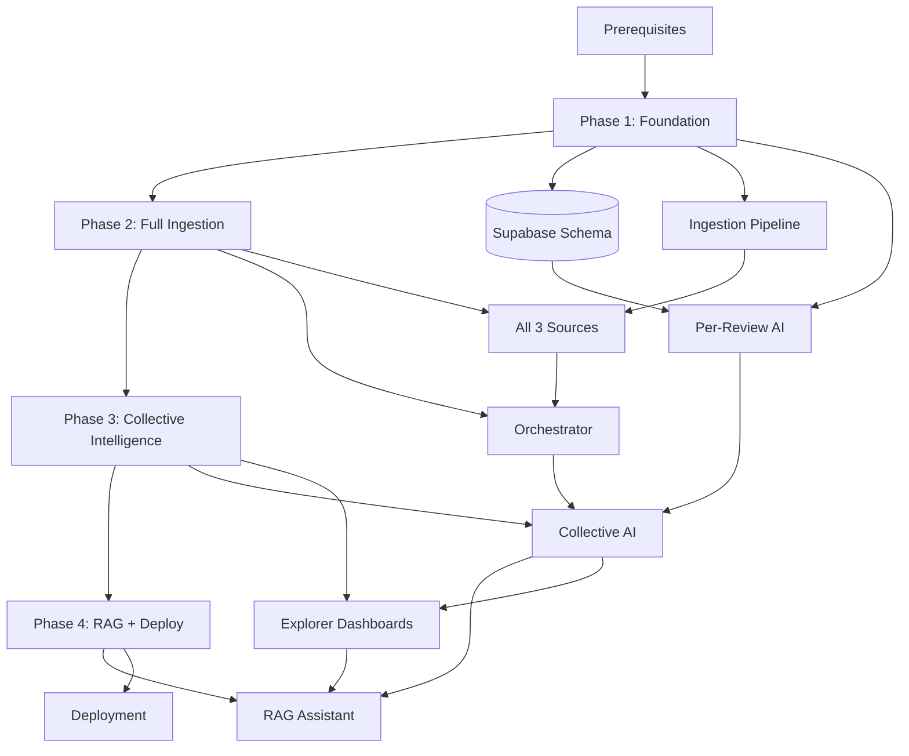

# Spotify Review Discovery Engine — Phase-Wise Implementation Plan

This document translates [`architecture.md`](./architecture.md) into a detailed, executable build plan across **4 phases (~4 weeks)**. Each phase ends with a demo-ready milestone, clear acceptance criteria, and a verification checklist.

---

## Plan Overview



| Phase | Duration | Milestone | Reviews Target |
|-------|----------|-----------|----------------|
| **Phase 1** | Week 1 | Ingest Play Store + analyze + basic dashboard | 500+ Play Store |
| **Phase 2** | Week 2 | All 3 sources + orchestrated fetch + 2 dashboards | 1000+ total |
| **Phase 3** | Week 3 | Collective intelligence + 5 explorer dashboards | Full analysis pipeline |
| **Phase 4** | Week 4 | RAG assistant + deployment + demo-ready polish | Production deploy |

---

## Prerequisites (Before Phase 1)

Complete these once before writing application code.

| # | Task | Details | Owner |
|---|------|---------|-------|
| P-1 | Create Supabase project | Enable pgvector extension in SQL editor | Dev |
| P-2 | Create Google AI (Gemini) API key | [aistudio.google.com/apikey](https://aistudio.google.com/apikey) — set usage limits | Dev |
| P-3 | Set Reddit User-Agent | No Reddit app needed — set `REDDIT_USER_AGENT` in `.env` (see [Reddit JSON API](#reddit-ingestion--public-json-api-chosen-approach)) | Dev |
| P-4 | Initialize Git repo | Push to GitHub (needed for Streamlit Cloud) | Dev |
| P-5 | Copy `.env.example` → `.env` | Fill required keys; only `REDDIT_USER_AGENT` needed for Reddit | Dev |

**Exit criteria:** Supabase project reachable; Gemini API key returns a test structured completion; Reddit JSON scraper returns sample posts (or CSV fallback loads); empty repo on GitHub.

---

## Reddit Ingestion — Public JSON API (Chosen Approach)

This project uses Reddit's **public JSON endpoints** via `httpx`. No OAuth app, no `praw`, no client ID/secret.

| Aspect | Detail |
|--------|--------|
| Library | `httpx` (in `requirements.txt`) |
| Auth | None — descriptive `User-Agent` header only |
| File | `src/ingestion/reddit_json_scraper.py` |
| Rate limit | ~10 req/min unauthenticated — **6–10s delay** between requests |
| Fallback | Auto-load `data/fallback/reddit_sample.csv` on 429/403 after retries |

### Endpoints

```text
# Subreddit search (per query term)
GET https://www.reddit.com/r/spotify/search.json?q=Spotify+recommendations&restrict_sr=on&limit=100&sort=relevance

# Hot posts (discovery-rich threads)
GET https://www.reddit.com/r/truespotify/hot.json?limit=100

# Post + comments
GET https://www.reddit.com/r/spotify/comments/{post_id}.json
```

**Required header:**

```text
User-Agent: spotify-review-engine/1.0 (contact: your@email.com)
```

### Collection Loop

```
For each subreddit in [spotify, truespotify, music, listentothis]:
  For each search term (8 terms):
    GET search.json → extract posts (title, selftext, score, id, created_utc)
    For top 5 posts by upvotes:
      GET comments/{post_id}.json → extract top-level comments
    Sleep 6–8 seconds
  Also fetch hot.json once per subreddit for high-engagement threads
Target: 200+ unique posts/comments
```

### Search Terms

```text
Spotify recommendations
Spotify discover weekly
Spotify smart shuffle
Spotify algorithm
Spotify music discovery
Spotify playlist recommendations
Spotify suggested songs
```

### RawRecord → Normalized Fields

| JSON field | Maps to |
|------------|---------|
| `data.children[].data.title` + `selftext` | `text` (combined) |
| `data.children[].data.score` | `metadata.upvotes` |
| `data.children[].data.subreddit` | `metadata.subreddit` |
| `data.children[].data.name` (e.g. `t3_abc`) | `metadata.external_id` |
| `data.children[].data.created_utc` | `review_date` |
| `data.children[].data.author` | `metadata.reviewer_name` |
| — | `source` = `"reddit"` |
| — | `rating` = `null` |

### Environment Variables

```env
REDDIT_USER_AGENT=spotify-review-engine/1.0 (contact: your@email.com)
REDDIT_REQUEST_DELAY_SECONDS=7
MIN_REVIEWS_REDDIT=200
```

### CSV Fallback (when JSON is blocked)

If live JSON returns **429** or **403** after 3 retries, the orchestrator automatically imports `data/fallback/reddit_sample.csv`. Users can also upload Reddit CSV via the sidebar at any time.

**Bundled CSV target:** 200+ rows with columns:

```csv
source,text,rating,review_date,reviewer_name,title,subreddit,upvotes,external_id
reddit,"Discover Weekly feels the same every week...",,,2024-03-15,user123,"Discover Weekly repetition",spotify,142,t3_abc123
```

**One-time CSV build tip:** Save JSON from a browser visit to the search URL above, then run a flatten script — same data source, no app required.

---

## AI Model Strategy & Structured JSON (All Phases)

Per [`architecture.md` §8.0](./architecture.md#80-llm-provider-abstraction--structured-outputs):

**Default LLM:** Google **Gemini 2.5 Flash** (`GEMINI_MODEL=gemini-2.5-flash`) for all generative tasks:

| Task | Model |
|------|-------|
| Per-review analysis & classification | Gemini 2.5 Flash |
| Sentiment analysis | Gemini 2.5 Flash |
| Theme extraction | Gemini 2.5 Flash |
| User segmentation summaries | Gemini 2.5 Flash |
| Root cause analysis | Gemini 2.5 Flash |
| Unmet need detection | Gemini 2.5 Flash |
| Executive summary | Gemini 2.5 Flash |
| Research Assistant (RAG) | Gemini 2.5 Flash |
| Embeddings (default) | `text-embedding-004` via `EMBEDDING_PROVIDER=gemini` |

**Provider swap:** Set `LLM_PROVIDER=openai` + `OPENAI_API_KEY` to use OpenAI instead — no code changes.

**Structured JSON rule:** Every AI engine must:
1. Define output in `src/schemas/{task}.py` (Pydantic model)
2. Call `src/llm/structured.py` → `structured_completion()` (provider-agnostic)
3. Provider enforces JSON schema (Gemini: `response_schema`; OpenAI: `json_schema`)
4. Validate response with Pydantic before Supabase insert
5. Retry up to 2× on validation failure

Implement provider layer in `src/llm/` (`factory.py`, `gemini_provider.py`, `openai_provider.py`).

---

## Phase 1 — Foundation (Week 1)

**Goal:** Stand up the project skeleton, database layer, Play Store ingestion (or CSV fallback), per-review AI analysis, embeddings, and a minimal Executive Summary dashboard.

**Demo at end of phase:** Upload or scrape Play Store reviews → run analysis → see total count, sentiment breakdown, and top problems on Executive Summary.

---

### 1.1 Project Scaffold (Day 1)

#### Tasks

| ID | Task | Files / Artifacts | Depends On |
|----|------|-------------------|------------|
| 1.1.1 | Create folder structure per architecture §5 | Full repo tree | Prerequisites |
| 1.1.2 | Add `requirements.txt` with pinned deps | See dependency list below | 1.1.1 |
| 1.1.2b | Add `src/llm/` + `src/schemas/` | Provider factory, Gemini provider, `structured.py` | 1.1.1 |
| 1.1.3 | Add `app/config.py` with `pydantic-settings` | `LLM_PROVIDER`, `GEMINI_*`, optional `OPENAI_*` | 1.1.1 |
| 1.1.4 | Add `streamlit_app.py` + `app/main.py` | Entry point, page config, sidebar shell | 1.1.3 |
| 1.1.5 | Add `.env.example`, `.gitignore` | Exclude `.env`, `__pycache__`, `.streamlit/secrets` | 1.1.1 |
| 1.1.6 | Add `README.md` with local setup steps | Clone → venv → pip → streamlit run | 1.1.2 |

#### `requirements.txt` (Phase 1 minimum)

```
streamlit>=1.32.0
supabase>=2.4.0
google-genai>=1.0.0
openai>=1.30.0
pydantic>=2.6.0
pydantic-settings>=2.2.0
google-play-scraper>=1.2.6
pandas>=2.2.0
plotly>=5.20.0
python-dotenv>=1.0.0
tenacity>=8.2.0
httpx>=0.27.0
```

> `openai` is included for optional `LLM_PROVIDER=openai` swap only. Default path uses `google-genai`.

#### Acceptance Criteria

- [ ] `streamlit run streamlit_app.py` launches without errors
- [ ] Config loads from `.env` and fails gracefully with a clear message if keys are missing
- [ ] Sidebar renders placeholder buttons: Fetch Reviews, Import CSV, Pipeline Status

---

### 1.2 Database Layer (Day 1–2)

#### Tasks

| ID | Task | Files / Artifacts | Depends On |
|----|------|-------------------|------------|
| 1.2.1 | Write `supabase/migrations/001_initial_schema.sql` | All core tables from architecture §6.3 | P-1 |
| 1.2.2 | Run migration in Supabase SQL editor | Verify tables + indexes exist | 1.2.1 |
| 1.2.3 | Add `pipeline_runs` table | `id`, `started_at`, `finished_at`, `status`, `stats JSONB` | 1.2.1 |
| 1.2.4 | Implement `src/db/client.py` | Supabase singleton using service role key | 1.2.3 |
| 1.2.5 | Implement `src/db/models.py` | Pydantic models: `Review`, `ReviewAnalysis`, `NormalizedReview`, `RawRecord` | 1.2.4 |
| 1.2.6 | Implement `src/db/repositories/reviews_repo.py` | `upsert_batch`, `get_unanalyzed`, `get_by_id`, `count_by_source` | 1.2.5 |
| 1.2.7 | Implement `src/db/repositories/analysis_repo.py` | `insert`, `get_by_review_id`, `aggregate_sentiment` | 1.2.5 |
| 1.2.8 | Implement `src/db/repositories/embeddings_repo.py` | `upsert`, `vector_search` (RPC or raw SQL) | 1.2.5 |
| 1.2.9 | Create Supabase RPC for vector search | `match_reviews(query_embedding, match_count)` | 1.2.8 |

#### Vector Search RPC (add to migration)

```sql
CREATE OR REPLACE FUNCTION match_reviews(
    query_embedding vector(768),
    match_count INT DEFAULT 15
)
RETURNS TABLE (review_id UUID, similarity FLOAT)
LANGUAGE plpgsql AS $$
BEGIN
    RETURN QUERY
    SELECT e.review_id, 1 - (e.embedding <=> query_embedding) AS similarity
    FROM embeddings e
    ORDER BY e.embedding <=> query_embedding
    LIMIT match_count;
END;
$$;
```

#### Acceptance Criteria

- [ ] Can insert a test review via repository and read it back
- [ ] Duplicate `content_hash` upsert is ignored (no error, no duplicate row)
- [ ] Vector search RPC returns results when a test embedding is inserted

#### Tests (Phase 1)

| Test | File | What to verify |
|------|------|----------------|
| Model validation | `tests/test_models.py` | Invalid source rejected; hash computed correctly |
| Repository upsert | `tests/test_reviews_repo.py` | Dedup on content_hash |
| Config loading | `tests/test_config.py` | Missing required env var raises clear error |

---

### 1.3 Ingestion Core (Day 2–3)

#### Tasks

| ID | Task | Files / Artifacts | Depends On |
|----|------|-------------------|------------|
| 1.3.1 | Define `SourceAdapter` protocol | `src/ingestion/base.py` | 1.2.5 |
| 1.3.2 | Implement `src/ingestion/cleaner.py` | Strip HTML, normalize whitespace, min length filter | 1.3.1 |
| 1.3.3 | Implement `src/ingestion/deduplicator.py` | SHA-256 hash; in-memory + DB dedup | 1.3.2 |
| 1.3.4 | Implement `src/ingestion/normalizer.py` | RawRecord → NormalizedReview canonical schema | 1.3.3 |
| 1.3.5 | Implement `src/ingestion/csv_importer.py` | Column mapping; source from CSV; max 10MB | 1.3.4 |
| 1.3.6 | Implement `src/ingestion/playstore_scraper.py` | `google-play-scraper`; keyword filters | 1.3.4 |
| 1.3.7 | Add sample fallback CSV | `data/fallback/playstore_sample.csv` (50+ rows) | 1.3.5 |
| 1.3.8 | Wire CSV uploader in sidebar | `app/main.py` → normalizer → reviews_repo | 1.3.5, 1.2.6 |

#### Play Store Scraper — Collection Strategy

```
1. Fetch latest reviews (paginate until 200+)
2. Fetch reviews sorted by helpfulness/rating extremes
3. Keyword filter pass: "recommend", "playlist", "discover", "shuffle", "suggested"
4. Merge results; dedupe by review ID + content hash
5. Target: 500+ unique reviews
```

#### CSV Importer — Expected Columns

| Column | Required | Maps To |
|--------|----------|---------|
| `source` | Yes | `playstore` / `appstore` / `reddit` |
| `text` or `review_text` | Yes | `text` |
| `rating` | No | `rating` |
| `review_date` or `date` | No | `review_date` |
| `reviewer_name` | No | `metadata.reviewer_name` |

#### Acceptance Criteria

- [ ] Play Store scraper returns ≥500 reviews for `com.spotify.music` (or CSV fallback loads equivalent)
- [ ] All records conform to canonical schema
- [ ] Spam/empty reviews filtered out
- [ ] CSV import produces identical DB rows as scraper path
- [ ] Sidebar CSV upload works end-to-end

#### Tests

| Test | What to verify |
|------|----------------|
| `test_normalizer.py` | Play Store raw JSON → canonical schema |
| `test_deduplicator.py` | Same text + source → same hash; different source → different hash |
| `test_csv_importer.py` | Sample CSV parses; missing required column raises error |

---

### 1.4 Per-Review AI Analysis (Day 4–5)

> **Model:** Gemini 2.5 Flash (`GEMINI_MODEL`) via `LLM_PROVIDER=gemini` · **Output:** schema-validated JSON via `schemas/review_analysis.py`

#### Tasks

| ID | Task | Files / Artifacts | Depends On |
|----|------|-------------------|------------|
| 1.4.1 | Write `src/schemas/review_analysis.py` | Pydantic model + JSON schema export | 1.1.2b |
| 1.4.2 | Write `prompts/review_analysis.txt` | System prompt; segment enums in schema (not free text) | 1.4.1 |
| 1.4.3 | Implement `src/llm/gemini_provider.py` | Gemini structured JSON via `response_schema` | 1.1.2b |
| 1.4.4 | Implement `src/llm/structured.py` | Provider-agnostic `structured_completion()` | 1.4.3 |
| 1.4.5 | Implement `src/analysis/review_analyzer.py` | Calls `structured_completion()` — no direct SDK import | 1.4.2 |
| 1.4.6 | Add batch processor | Chunks of 15; tenacity retry on rate limit | 1.4.5 |
| 1.4.7 | Mark `reviews.analyzed_at` on success | Idempotent: skip if already analyzed | 1.4.6 |
| 1.4.8 | Implement `src/analysis/embedding_service.py` | Gemini `text-embedding-004` → embeddings_repo | 1.2.8 |
| 1.4.9 | Add CLI/script trigger | `python -m src.pipeline.run_analysis` for dev | 1.4.7, 1.4.8 |

#### Output Schema (`schemas/review_analysis.py`)

Enforced via provider JSON schema — not prompt-only:

```json
{
  "sentiment": "positive|negative|neutral|mixed",
  "primary_problem": "string",
  "recommendation_complaint": true,
  "user_goal": "string",
  "listening_behavior": "string",
  "user_segment": "Casual Listener|Playlist-Dependent Listener|Music Explorer|Genre Loyalist|Power User",
  "discovery_challenge": "string",
  "confidence_score": 0.85
}
```

#### Cost Estimate (Phase 1 — 500 reviews, Gemini 2.5 Flash)

| Step | Tokens (approx) | Cost (approx) |
|------|-----------------|---------------|
| Per-review analysis (500 × ~800 tokens) | ~400K | ~$0.03–0.08 |
| Embeddings (500 × ~200 tokens) | ~100K | ~$0.01 |

#### Acceptance Criteria

- [ ] ≥95% of ingested reviews have a `review_analysis` row
- [ ] All LLM outputs validated by Pydantic before DB insert (no raw JSON writes)
- [ ] Invalid schema responses retried; failures logged with review ID
- [ ] All 5 user segments appear at least once (or documented why not)
- [ ] Embeddings stored for all analyzed reviews
- [ ] Re-running analysis skips already-analyzed reviews (no duplicate analysis rows)
- [ ] Rate limit errors retry and resume (not fail entire batch)

#### Tests

| Test | What to verify |
|------|----------------|
| `test_review_analyzer.py` | Mock Gemini provider returns valid JSON → Pydantic validates → maps to ReviewAnalysis |
| `test_llm_factory.py` | `LLM_PROVIDER=gemini` loads Gemini; `LLM_PROVIDER=openai` loads OpenAI |
| `test_schemas.py` | Invalid enum / missing field rejected by schema |
| Integration (manual) | Analyze 10 reviews; inspect Supabase rows |

---

### 1.5 Executive Summary Dashboard (Day 6–7)

#### Tasks

| ID | Task | Files / Artifacts | Depends On |
|----|------|-------------------|------------|
| 1.5.1 | Implement `src/services/dashboard_service.py` | KPI queries: totals, top problem, sentiment, trust score | 1.2.6, 1.2.7 |
| 1.5.2 | Create `app/components/kpi_card.py` | Reusable metric card | 1.5.1 |
| 1.5.3 | Create `app/pages/01_executive_summary.py` | KPI grid + charts | 1.5.2 |
| 1.5.4 | Add DB health indicator | Green/red connection status | 1.5.3 |
| 1.5.5 | Add "Run Analysis" button (Phase 1 scope) | Triggers analyzer on unanalyzed reviews | 1.4.6 |

#### Executive Summary — KPI Definitions

| KPI | Calculation |
|-----|-------------|
| Total reviews analyzed | `COUNT(reviews WHERE analyzed_at IS NOT NULL)` |
| Top discovery challenge | `MODE(discovery_challenge)` from review_analysis |
| Most affected segment | Segment with highest avg negative sentiment |
| Recommendation trust score | `1 - (rec_complaint_rate among negative reviews)` scaled 0–100 |
| Sentiment breakdown | % positive / negative / neutral / mixed |

#### Acceptance Criteria

- [ ] Dashboard loads in <3s with 500+ reviews
- [ ] All KPI cards show real data (not placeholders)
- [ ] Sentiment chart renders correctly
- [ ] "Run Analysis" processes pending reviews and refreshes dashboard
- [ ] Empty state shown when no data ("Import CSV or fetch reviews to begin")

---

### Phase 1 Deliverables Checklist

```
✓ Repo scaffold with config, entry point, requirements
✓ Supabase schema deployed (7 tables + pipeline_runs + RPC)
✓ Repository layer with upsert + query methods
✓ Play Store scraper OR CSV fallback with 500+ reviews
✓ Normalizer / cleaner / deduplicator pipeline
✓ Per-review Gemini 2.5 Flash analysis (schema-validated JSON) + embeddings
✓ `src/llm/` provider layer + `schemas/review_analysis.py`
✓ Executive Summary dashboard (Page 1)
✓ Unit tests for core ingestion + models
✓ README with local setup instructions
```

### Phase 1 Demo Script

1. Launch app locally
2. Click **Import CSV** → upload `data/fallback/playstore_sample.csv` (or run Play Store scraper)
3. Click **Run Analysis** → wait for progress bar
4. Navigate to **Executive Summary** → show KPIs and sentiment chart
5. Open Supabase → show `reviews`, `review_analysis`, `embeddings` rows

---

## Phase 2 — Full Ingestion & Orchestration (Week 2)

**Goal:** Add App Store and Reddit sources, build the pipeline orchestrator with "Fetch Latest Reviews", and ship Source Analysis + Discovery Challenges dashboards.

**Demo at end of phase:** One button fetches from all 3 sources, runs analysis, and populates 3 dashboard pages with comparative insights.

---

### 2.1 App Store Scraper (Day 8–9)

#### Tasks

| ID | Task | Files / Artifacts | Depends On |
|----|------|-------------------|------------|
| 2.1.1 | Implement `src/ingestion/appstore_scraper.py` | `app-store-scraper` or iTunes RSS fallback | Phase 1 ingestion |
| 2.1.2 | Add RSS fallback path | If scraper fails, fetch iTunes customer reviews RSS | 2.1.1 |
| 2.1.3 | Keyword filter pass | "recommend", "playlist", "discover", "personalization" | 2.1.1 |
| 2.1.4 | Add `data/fallback/appstore_sample.csv` | 50+ sample rows for offline demo | 2.1.1 |
| 2.1.5 | Integration test | ≥300 unique App Store reviews ingested | 2.1.3 |

#### App Store Collection Strategy

```
1. Fetch reviews for app ID 324684580 (Spotify)
2. Paginate recent reviews (sort by date)
3. Fetch highest-rated and lowest-rated samples
4. Keyword filter for discovery-related terms
5. Target: 300+ unique reviews
```

#### Acceptance Criteria

- [ ] App Store adapter implements `SourceAdapter` protocol
- [ ] Output normalizes identically to Play Store path
- [ ] Scraper failure falls back to RSS or logs warning without crashing pipeline
- [ ] ≥300 App Store reviews in DB after full fetch

---

### 2.2 Reddit JSON Scraper (Day 9–10)

> Uses [Public JSON API](#reddit-ingestion--public-json-api-chosen-approach) — `httpx` only, no OAuth.

#### Tasks

| ID | Task | Files / Artifacts | Depends On |
|----|------|-------------------|------------|
| 2.2.1 | Implement `src/ingestion/reddit_json_scraper.py` | `SourceAdapter`; search + hot + comments endpoints | Phase 1 ingestion |
| 2.2.2 | Configure search terms (8 queries) | From [Search Terms](#search-terms) above | 2.2.1 |
| 2.2.3 | Configure subreddits (4) | r/spotify, r/truespotify, r/music, r/listentothis | 2.2.1 |
| 2.2.4 | Parse JSON response → `RawRecord` | Map `title`, `selftext`, `score`, `name`, `created_utc`, `author` | 2.2.1 |
| 2.2.5 | Extract posts + top comments | Combine title + post_text; fetch `comments/{id}.json` for top 5 posts | 2.2.4 |
| 2.2.6 | Reddit-specific dedup | Dedup by `metadata.external_id` (`t3_` / `t1_` prefix) | 2.2.5 |
| 2.2.7 | Rate-limit handling | `REDDIT_REQUEST_DELAY_SECONDS`; tenacity retry on 429; max 3 retries | 2.2.1 |
| 2.2.8 | Truncate long threads | Max 4000 chars per normalized text | 2.2.5 |
| 2.2.9 | Add `data/fallback/reddit_sample.csv` | 200+ rows — auto-loaded on JSON failure | 2.2.1 |
| 2.2.10 | Wire into orchestrator | `reddit_json_scraper.fetch()` called in parallel with other scrapers | 2.2.7 |

#### Reddit Search Terms

```
Spotify recommendations
Spotify discover weekly
Spotify smart shuffle
Spotify algorithm
Spotify music discovery
Spotify playlist recommendations
Spotify suggested songs
```

#### Acceptance Criteria

- [ ] ≥200 Reddit posts/comments ingested via JSON scraper
- [ ] No `REDDIT_CLIENT_ID` or `REDDIT_CLIENT_SECRET` in config
- [ ] `User-Agent` header sent on every request
- [ ] `metadata` includes subreddit, upvotes, external_id
- [ ] No duplicate Reddit entries on re-fetch
- [ ] Long posts truncated without losing core complaint text
- [ ] 429/403 after 3 retries → orchestrator auto-loads `reddit_sample.csv` and logs warning

---

### 2.3 Pipeline Orchestrator (Day 11–12)

#### Tasks

| ID | Task | Files / Artifacts | Depends On |
|----|------|-------------------|------------|
| 2.3.1 | Implement `src/pipeline/orchestrator.py` | Full pipeline from architecture §11 | 2.1, 2.2, Phase 1 |
| 2.3.2 | Parallel scraper execution | `asyncio.gather` with per-source exception isolation | 2.3.1 |
| 2.3.3 | Persist pipeline run state | Insert/update `pipeline_runs` row | 2.3.1 |
| 2.3.4 | Wire "Fetch Latest Reviews" button | Sidebar → orchestrator → progress UI | 2.3.1 |
| 2.3.5 | Add pipeline status panel | Last run time, per-source counts, errors | 2.3.4 |
| 2.3.6 | Incremental analysis trigger | Auto-run analyzer + embeddings on new IDs only | 2.3.1 |

#### PipelineResult Schema

```python
@dataclass
class PipelineResult:
    run_id: UUID
    sources: dict[str, SourceResult]  # fetched, new, errors
    analyzed_count: int
    embedded_count: int
    duration_seconds: float
    status: Literal["success", "partial", "failed"]
```

#### Error Isolation Rules

| Source Failure | Pipeline Behavior |
|----------------|-------------------|
| Play Store fails | Continue App Store + Reddit; show warning in UI |
| App Store fails | Continue others; suggest CSV upload for App Store |
| Reddit fails | Auto-fallback to bundled CSV; JSON mode: retry with backoff, then CSV |
| All sources fail | Status = failed; prompt CSV import |
| LLM fails mid-analysis | Save progress; resume on next run |

#### Acceptance Criteria

- [ ] "Fetch Latest Reviews" completes end-to-end from UI
- [ ] Partial failures show per-source status (not generic error)
- [ ] Re-fetch does not create duplicate reviews
- [ ] Pipeline run logged in `pipeline_runs` with stats JSON
- [ ] Total reviews ≥1000 after full fetch (500+300+200)

---

### 2.4 Source Analysis Dashboard (Day 13)

#### Tasks

| ID | Task | Files / Artifacts | Depends On |
|----|------|-------------------|------------|
| 2.4.1 | Extend `dashboard_service.py` | Source-level aggregations | 2.3 |
| 2.4.2 | Create `app/components/sentiment_chart.py` | Stacked bar by source | 2.4.1 |
| 2.4.3 | Create `app/pages/02_source_analysis.py` | Review count, sentiment, top complaints by source | 2.4.2 |
| 2.4.4 | Add source comparison table | Side-by-side metrics | 2.4.3 |

#### Page 2 — Required Visualizations

| Visualization | Data |
|---------------|------|
| Review count by source | Bar chart: playstore / appstore / reddit |
| Sentiment by source | Stacked bar: pos/neg/neutral/mixed per source |
| Top complaints by source | Top 5 `primary_problem` per source |
| Source comparison table | Count, avg rating, rec complaint %, avg sentiment |

#### Acceptance Criteria

- [ ] All 3 sources represented (or graceful empty state per source)
- [ ] Charts interactive (Plotly hover tooltips)
- [ ] Data refreshes after pipeline run without app restart

---

### 2.5 Discovery Challenges Dashboard — Scaffold (Day 14)

> Full theme data comes in Phase 3. This page ships with **per-review discovery_challenge aggregations** as interim data.

#### Tasks

| ID | Task | Files / Artifacts | Depends On |
|----|------|-------------------|------------|
| 2.5.1 | Add `get_top_discovery_challenges()` to dashboard service | GROUP BY discovery_challenge, COUNT, avg sentiment | 2.4 |
| 2.5.2 | Create `app/pages/03_discovery_challenges.py` | Ranked table: challenge, frequency, affected segments | 2.5.1 |
| 2.5.3 | Add placeholder note | "Full theme analysis available after collective analysis (Phase 3)" | 2.5.2 |

#### Acceptance Criteria

- [ ] Top 10 discovery challenges displayed with frequency
- [ ] Segment breakdown column shows which segments are most affected
- [ ] Page loads from `review_analysis` alone (no dependency on `themes` table yet)

---

### Phase 2 Deliverables Checklist

```
✓ App Store scraper (300+ reviews) with RSS/CSV fallback
✓ Reddit JSON scraper (`reddit_json_scraper.py`) — 200+ discussions, no OAuth
✓ Pipeline orchestrator with parallel fetch + incremental analysis
✓ "Fetch Latest Reviews" wired in sidebar with progress + status
✓ pipeline_runs table populated on each run
✓ Source Analysis dashboard (Page 2)
✓ Discovery Challenges dashboard — interim version (Page 3)
✓ 1000+ total reviews in Supabase
✓ Fallback CSVs for all 3 sources
```

### Phase 2 Demo Script

1. Click **Fetch Latest Reviews** → show progress for 3 sources
2. Show pipeline status panel with per-source counts
3. Open **Source Analysis** → compare Play Store vs App Store vs Reddit sentiment
4. Open **Discovery Challenges** → show top challenges from per-review analysis
5. Re-click fetch → demonstrate dedup (new count << total fetched)

---

## Phase 3 — Collective Intelligence (Week 3)

**Goal:** Build the four collective AI engines (themes, segments, root causes, unmet needs), upgrade Discovery Challenges to use theme data, and ship Theme Explorer, Segment Explorer, Root Cause, Unmet Needs, and Discovery Journey dashboards.

**Demo at end of phase:** After collective analysis, navigate all explorer dashboards with drill-down from theme → evidence → segments → root causes.

---

### 3.1 Prompt Library (Day 15)

#### Tasks

| ID | Task | Files / Artifacts | Depends On |
|----|------|-------------------|------------|
| 3.1.0 | Create schema modules for all collective engines | `src/schemas/themes.py`, `segments.py`, `root_causes.py`, `unmet_needs.py` | 1.1.2b |
| 3.1.1 | Write `prompts/theme_extraction.txt` | Gemini; input: frequency stats + 50 sample reviews | 3.1.0 |
| 3.1.2 | Write `prompts/segmentation.txt` | Gemini; input: per-segment aggregates | 3.1.0 |
| 3.1.3 | Write `prompts/root_cause.txt` | Gemini; input: theme patterns + negative review samples | 3.1.0 |
| 3.1.4 | Write `prompts/unmet_needs.txt` | Gemini; input: user_goal vs discovery_challenge gaps | 3.1.0 |

#### Prompt Design Rules (All Collective Prompts)

- Use provider-agnostic **`structured_completion()`** — schema defined in `src/schemas/`
- Gemini enforces via `response_schema`; OpenAI swap enforces via `json_schema`
- Always request **evidence review IDs** as typed UUID arrays in schema
- Constrain enums in Pydantic schema (segments, sentiment) — not in prompt prose
- Validate with Pydantic before any Supabase write
- Include instruction: "Base conclusions only on provided data; do not invent reviews"
- On validation failure: retry up to 2× with same schema

---

### 3.2 Theme Extraction Engine (Day 15–16)

#### Tasks

| ID | Task | Files / Artifacts | Depends On |
|----|------|-------------------|------------|
| 3.2.1 | Implement `src/analysis/theme_extractor.py` | `schemas/themes.py` via `structured_completion()` | 3.1.1 |
| 3.2.2 | Pre-aggregate in SQL | Top 30 discovery_challenge + primary_problem by frequency | 3.2.1 |
| 3.2.3 | Sample 50 representative reviews | Stratified by sentiment + source | 3.2.1 |
| 3.2.4 | LLM synthesis → theme list | 5–15 themes with names matching problemStatement examples | 3.2.1 |
| 3.2.5 | Compute `impact_score` | `(freq × neg_sentiment × rec_complaint_rate)` normalized 0–100 | 3.2.4 |
| 3.2.6 | Populate `theme_reviews` junction | Link each theme to supporting review IDs | 3.2.4 |
| 3.2.7 | Implement `src/db/repositories/themes_repo.py` | upsert, get_all, get_with_reviews | 3.2.6 |

#### Acceptance Criteria

- [ ] All collective engine outputs pass Pydantic validation before DB write
- [ ] 5–15 themes generated with frequency > 0
- [ ] Each theme has ≥3 representative review IDs
- [ ] `affected_segments` array populated per theme
- [ ] Re-run is idempotent (upsert by theme_name)

---

### 3.3 Segmentation Engine (Day 16–17)

#### Tasks

| ID | Task | Files / Artifacts | Depends On |
|----|------|-------------------|------------|
| 3.3.1 | Implement `src/analysis/segment_engine.py` | `schemas/segments.py` via `structured_completion()` | 3.1.2 |
| 3.3.2 | SQL aggregation per segment | COUNT, top goals, behaviors, frustrations, rec complaint rate | 3.3.1 |
| 3.3.3 | LLM JSON summary per segment | Validated `listening_goals`, `discovery_behavior`, `top_frustrations` arrays | 3.3.2 |
| 3.3.4 | Compute `recommendation_trust_score` per segment | `1 - rec_complaint_rate` scaled 0–100 | 3.3.2 |
| 3.3.5 | Implement `src/db/repositories/segments_repo.py` | upsert, get_all, get_by_name | 3.3.4 |

#### Expected Segments (all must exist if data supports)

```
Casual Listener
Playlist-Dependent Listener
Music Explorer
Genre Loyalist
Power User
```

#### Acceptance Criteria

- [ ] All 5 segments have rows in `segments` table
- [ ] `size` matches COUNT from review_analysis
- [ ] `listening_goals`, `discovery_behavior`, `top_frustrations` are populated JSON arrays
- [ ] Trust score differs meaningfully across segments (not all identical)

---

### 3.4 Root Cause Engine (Day 17–18)

#### Tasks

| ID | Task | Files / Artifacts | Depends On |
|----|------|-------------------|------------|
| 3.4.1 | Implement `src/analysis/root_cause_engine.py` | `schemas/root_causes.py` via `structured_completion()` | 3.1.3, 3.2 |
| 3.4.2 | Input: top themes + negative review cluster | Max 40 reviews in prompt | 3.4.1 |
| 3.4.3 | Output: 5–10 root causes | Examples from problemStatement as guidance | 3.4.1 |
| 3.4.4 | Link `supporting_evidence_ids` | Must reference real review UUIDs | 3.4.3 |
| 3.4.5 | Implement `src/db/repositories/root_causes_repo.py` | upsert, get_all, get_with_evidence | 3.4.4 |

#### Acceptance Criteria

- [ ] ≥5 root causes with frequency and evidence IDs
- [ ] Each root cause maps to ≥1 affected segment
- [ ] Root causes are distinct from themes (causal vs descriptive)

---

### 3.5 Unmet Need Detector (Day 18)

#### Tasks

| ID | Task | Files / Artifacts | Depends On |
|----|------|-------------------|------------|
| 3.5.1 | Implement `src/analysis/unmet_need_detector.py` | `schemas/unmet_needs.py` via `structured_completion()` | 3.1.4, 3.2 |
| 3.5.2 | Gap analysis input | user_goal vs discovery_challenge pairs with high frequency | 3.5.1 |
| 3.5.3 | Output: 5–10 unmet needs + AI solution suggestions | Examples: Mood-Aware Discovery, Guided Exploration, etc. | 3.5.1 |
| 3.5.4 | Compute `opportunity_score` | `(freq × severity × segment_breadth)` normalized 0–100 | 3.5.3 |
| 3.5.5 | Implement `src/db/repositories/unmet_needs_repo.py` | upsert, get_all, get_top_by_opportunity | 3.5.4 |

#### Acceptance Criteria

- [ ] ≥5 unmet needs with opportunity scores
- [ ] Each need has ≥2 supporting review IDs
- [ ] `suggested_ai_solutions` JSON array has ≥1 suggestion per need

---

### 3.6 Collective Analysis Orchestration (Day 19)

#### Tasks

| ID | Task | Files / Artifacts | Depends On |
|----|------|-------------------|------------|
| 3.6.1 | Add `run_collective_analysis()` to orchestrator | Runs all 4 engines in sequence | 3.2–3.5 |
| 3.6.2 | Add threshold logic | Auto-run when ≥50 new reviews since last collective run | 3.6.1 |
| 3.6.3 | Add "Re-run Collective Analysis" sidebar button | Manual trigger for demo | 3.6.1 |
| 3.6.4 | Store collective run timestamp | In pipeline_runs or separate metadata row | 3.6.1 |

#### Acceptance Criteria

- [ ] Collective analysis runs after full pipeline fetch
- [ ] Manual re-run works from sidebar
- [ ] All 4 output tables populated
- [ ] Dashboard pages reflect new data on `st.rerun()` or auto-refresh

---

### 3.7 Explorer Dashboards (Day 19–21)

#### Page 3 Upgrade — Discovery Challenges (theme-powered)

| ID | Task | File |
|----|------|------|
| 3.7.1 | Upgrade to use `themes` table | `app/pages/03_discovery_challenges.py` |
| 3.7.2 | Show impact score badges | Sorted by impact_score DESC |

#### Page 4 — Theme Explorer

| ID | Task | Detail |
|----|------|--------|
| 3.7.3 | Theme selector dropdown | All themes sorted by frequency |
| 3.7.4 | Drill-down panel | Supporting reviews (expandable), segment pie chart |
| 3.7.5 | Related links | Show related root causes + unmet needs for selected theme |

#### Page 5 — Segment Explorer

| ID | Task | Detail |
|----|------|--------|
| 3.7.6 | Segment cards | One card per segment with size + trust score |
| 3.7.7 | Detail view | Listening goals, discovery behavior, top frustrations lists |

#### Page 6 — Root Cause Analysis

| ID | Task | Detail |
|----|------|--------|
| 3.7.8 | Ranked root cause table | Frequency + affected segments |
| 3.7.9 | Evidence panel | `app/components/evidence_list.py` — expandable review excerpts |

#### Page 7 — Unmet Needs & Opportunities

| ID | Task | Detail |
|----|------|--------|
| 3.7.10 | Opportunity matrix | Scatter: frequency vs opportunity_score |
| 3.7.11 | AI solution cards | From `suggested_ai_solutions` JSON |

#### Shared Components to Build

| Component | File | Used By |
|-----------|------|---------|
| KPI card | `app/components/kpi_card.py` | Pages 1, 5 |
| Sentiment chart | `app/components/sentiment_chart.py` | Pages 2, 5 |
| Evidence list | `app/components/evidence_list.py` | Pages 4, 6, 7 |
| Segment badge | `app/components/segment_badge.py` | Pages 3, 4, 5 |

#### Acceptance Criteria

- [ ] Theme click → shows ≥3 supporting reviews
- [ ] Segment cards show distinct data per segment
- [ ] Root cause evidence links to real review text
- [ ] Unmet needs page shows opportunity matrix with labeled points
- [ ] All pages handle empty state gracefully

---

### 3.8 Discovery Journey Dashboard (Day 21)

#### Tasks

| ID | Task | Files / Artifacts | Depends On |
|----|------|-------------------|------------|
| 3.8.1 | Implement `src/services/journey_service.py` | Build journey chains from review_analysis | 3.3 |
| 3.8.2 | Define journey chain logic | user_goal → listening_behavior → discovery_challenge → workaround (from primary_problem) → desired outcome (inferred) | 3.8.1 |
| 3.8.3 | Create `app/components/journey_sankey.py` | Plotly Sankey or step diagram | 3.8.1 |
| 3.8.4 | Create `app/pages/08_discovery_journey.py` | Top 5 journey paths + detail view | 3.8.3 |

#### Journey Chain Example (from problemStatement)

```
Discover New Music → Discover Weekly → Recommendations Feel Similar → Use Instagram Reels → Find Fresh Music
```

#### Acceptance Criteria

- [ ] ≥3 distinct journey paths visualized
- [ ] Journey derived from real aggregated review_analysis data
- [ ] Sankey/step diagram renders without error
- [ ] Clicking a path shows supporting review count

---

### Phase 3 Deliverables Checklist

```
✓ 4 collective AI engines (Gemini 2.5 Flash, schema-validated JSON)
✓ `src/schemas/` modules for all collective engines
✓ All collective prompts in prompts/
✓ Repositories for themes, segments, root_causes, unmet_needs
✓ theme_reviews junction populated
✓ Collective analysis wired into orchestrator + manual trigger
✓ Discovery Challenges upgraded to theme data (Page 3)
✓ Theme Explorer (Page 4)
✓ Segment Explorer (Page 5)
✓ Root Cause Analysis (Page 6)
✓ Unmet Needs & Opportunities (Page 7)
✓ Discovery Journey (Page 8)
✓ Shared UI components library
```

### Phase 3 Demo Script

1. Click **Re-run Collective Analysis** → show progress
2. **Discovery Challenges** → top themes with impact scores
3. **Theme Explorer** → select "Repetitive Recommendations" → show evidence + segments
4. **Segment Explorer** → compare Music Explorer vs Playlist-Dependent Listener
5. **Root Cause Analysis** → show "Algorithm Similarity Bias" with evidence
6. **Unmet Needs** → show "Guided Exploration" opportunity card
7. **Discovery Journey** → walk through Sankey from goal to outcome

---

## Phase 4 — RAG Assistant, Validation & Deployment (Week 4)

**Goal:** Ship the AI Research Assistant with RAG + citations, Interview Validation scaffold, Executive AI summary, deployment to Streamlit Cloud, and a complete demo pack.

**Demo at end of phase:** Full evaluator-ready demo — fetch → analyze → explore dashboards → ask strategic questions to Research Assistant with cited evidence.

---

### 4.1 RAG Infrastructure (Day 22–23)

#### Tasks

| ID | Task | Files / Artifacts | Depends On |
|----|------|-------------------|------------|
| 4.1.0 | Write `src/schemas/research_assistant.py` | Pydantic model for RAG response shape | 1.1.2b |
| 4.1.1 | Implement `src/rag/retriever.py` | Hybrid: vector search + structured filters | Phase 1 embeddings |
| 4.1.2 | Implement `src/rag/context_builder.py` | Bundle: reviews + themes + segments + root_causes + unmet_needs | 4.1.1 |
| 4.1.3 | Write `prompts/research_assistant.txt` | Gemini system prompt; schema via `schemas/research_assistant.py` | 4.1.0 |
| 4.1.4 | Implement `src/rag/research_assistant.py` | `structured_completion()` → validated response | 4.1.3 |
| 4.1.5 | Add confidence filter | Exclude review_analysis where confidence_score < 0.5 from RAG | 4.1.1 |

#### Hybrid Retrieval Logic

```
1. Embed user question → vector search top 15 reviews
2. Keyword boost: also fetch reviews where primary_problem or discovery_challenge matches question terms
3. Inject top 5 themes, top 3 root causes, top 3 unmet needs as aggregate context
4. Total context budget: ~6000 tokens
5. Pass to Gemini via `structured_completion()` with `research_assistant.txt` + schema
6. Validate response with Pydantic; render in UI only after validation passes
```

#### Response Schema (`schemas/research_assistant.py`)

Enforced via provider JSON schema — validated before UI render:

```json
{
  "summary": "2-3 sentence answer",
  "key_themes": ["theme1", "theme2"],
  "root_causes": ["cause1"],
  "affected_segments": ["Music Explorer"],
  "supporting_evidence": [
    {
      "review_id": "uuid",
      "excerpt": "first 200 chars",
      "source": "playstore",
      "rating": 2
    }
  ],
  "product_opportunities": ["opportunity1"],
  "confidence": 0.82
}
```

#### Acceptance Criteria

- [ ] Retriever returns ≥3 evidence items for test questions
- [ ] Response validated by Pydantic; malformed LLM output never shown in UI
- [ ] Response includes real review IDs that exist in DB
- [ ] Low-confidence reviews excluded from retrieval
- [ ] Context builder stays within token budget

---

### 4.2 Research Assistant UI (Day 23–24)

#### Tasks

| ID | Task | Files / Artifacts | Depends On |
|----|------|-------------------|------------|
| 4.2.1 | Create `app/pages/10_research_assistant.py` | Chat interface with `st.chat_message` | 4.1.4 |
| 4.2.2 | Citation sidebar | Expandable review excerpts with source badge + rating | 4.2.1 |
| 4.2.3 | Suggested questions | Clickable chips for common PM questions | 4.2.1 |
| 4.2.4 | Response sections | Summary, themes, root causes, segments, opportunities | 4.2.1 |
| 4.2.5 | Chat history | `st.session_state.messages` persistence within session | 4.2.1 |

#### Suggested Questions (from problemStatement)

```
Why do users struggle to discover new music?
What causes repetitive listening?
Which user segment faces the biggest discovery challenge?
What recommendation complaints are increasing?
What unmet needs are emerging?
Show evidence supporting these conclusions.
```

#### Acceptance Criteria

- [ ] Chat UI renders question → structured response
- [ ] ≥3 citations per strategic question
- [ ] Suggested question chips populate input and submit
- [ ] Citations expandable to show full review text
- [ ] Response time <10s for typical question

---

### 4.3 Executive AI Summary (Day 24)

#### Tasks

| ID | Task | Files / Artifacts | Depends On |
|----|------|-------------------|------------|
| 4.3.0 | Write `src/schemas/executive_summary.py` | Pydantic model: `summary`, `key_findings[]`, `top_opportunity` | 1.1.2b |
| 4.3.1 | Add `generate_executive_summary()` to dashboard service | Gemini via `structured_completion()` on themes/segments/root causes/unmet needs | 4.3.0, Phase 3 |
| 4.3.2 | Cache summary in session or DB | Regenerate only on collective analysis re-run | 4.3.1 |
| 4.3.3 | Add summary panel to Executive Summary page | Markdown render of AI summary | 4.3.1 |

#### Acceptance Criteria

- [ ] Executive summary returned as validated JSON then rendered as markdown
- [ ] Summary references real themes and segments from DB
- [ ] Cached summary loads instantly on page revisit

---

### 4.4 Interview Validation Scaffold (Day 25)

#### Tasks

| ID | Task | Files / Artifacts | Depends On |
|----|------|-------------------|------------|
| 4.4.1 | Add `interview_insights` table | Migration 002 or append to 001 | Phase 3 |
| 4.4.2 | Implement basic CRUD in repository | Insert/list insights | 4.4.1 |
| 4.4.3 | Create `app/pages/09_interview_validation.py` | Comparison table UI | 4.4.2 |
| 4.4.4 | Manual entry form | Insight text, linked theme, validation %, confidence, notes | 4.4.3 |
| 4.4.5 | Auto-link review evidence | For linked theme, show supporting review count | 4.4.3 |

#### Page 9 — Columns

| Column | Source |
|--------|--------|
| Insight | `interview_insights.insight` |
| Review Evidence | Count + link from linked theme |
| Interview Validation % | Manual entry |
| Confidence Score | Manual entry or computed |

#### Acceptance Criteria

- [ ] Can add/edit interview insights from UI
- [ ] Linked theme shows review evidence count
- [ ] Page labeled "Part 2 — User Research Validation" for case study continuity
- [ ] Works with zero interview data (empty state with instructions)

---

### 4.5 Deployment (Day 26–27)

#### Tasks

| ID | Task | Files / Artifacts | Depends On |
|----|------|-------------------|------------|
| 4.5.1 | Add `Dockerfile` | Python 3.11 slim; streamlit on $PORT | All phases |
| 4.5.2 | Add `.streamlit/config.toml` | Theme, layout wide, page title | 4.5.1 |
| 4.5.3 | Deploy to Streamlit Cloud | Connect GitHub; set secrets | 4.5.2 |
| 4.5.4 | Verify secrets | SUPABASE_URL, SUPABASE_SERVICE_KEY, GEMINI_API_KEY, REDDIT_USER_AGENT | 4.5.3 |
| 4.5.5 | Smoke test deployed app | Fetch, analyze, dashboard, RAG | 4.5.4 |
| 4.5.6 | Add health indicator | DB connected + last pipeline run on Executive Summary | 4.5.5 |

#### Streamlit Cloud Secrets Format

```toml
# .streamlit/secrets.toml (local only — set via Cloud dashboard in prod)
SUPABASE_URL = "..."
SUPABASE_SERVICE_KEY = "..."
LLM_PROVIDER = "gemini"
GEMINI_API_KEY = "..."
GEMINI_MODEL = "gemini-2.5-flash"
EMBEDDING_PROVIDER = "gemini"
GEMINI_EMBEDDING_MODEL = "text-embedding-004"
EMBEDDING_DIMENSIONS = "768"
REDDIT_USER_AGENT = "spotify-review-engine/1.0 (contact: your@email.com)"
REDDIT_REQUEST_DELAY_SECONDS = "7"
```

#### Production Checklist (from architecture §13.1)

- [ ] Supabase RLS enabled; service key not exposed client-side
- [ ] LLM rate limiting via tenacity backoff (Gemini / OpenAI)
- [ ] Scraper timeout (30s per source) + partial success
- [ ] Fallback CSVs bundled in `data/fallback/`
- [ ] `requirements.txt` pinned
- [ ] Health indicator on Executive Summary

#### Acceptance Criteria

- [ ] Public URL loads all 10 pages
- [ ] Pipeline runs successfully on deployed environment
- [ ] RAG assistant works on deployed environment
- [ ] App functional with CSV fallback when scrapers blocked

---

### 4.6 Demo Pack & Documentation (Day 28)

#### Tasks

| ID | Task | Files / Artifacts | Depends On |
|----|------|-------------------|------------|
| 4.6.1 | Create full fallback dataset | 500 Play + 300 App + 200 Reddit sample CSVs | All phases |
| 4.6.2 | Write `docs/demo-script.md` | 10-minute evaluator walkthrough | 4.6.1 |
| 4.6.3 | Pre-load demo data option | Script: `python -m src.pipeline.seed_demo` | 4.6.1 |
| 4.6.4 | Final README update | Architecture link, deploy URL, demo instructions | 4.6.2 |
| 4.6.5 | End-to-end test pass | Manual QA against all acceptance criteria | All |

#### Demo Script Outline (10 minutes)

| Minute | Action |
|--------|--------|
| 0–1 | Problem framing: Spotify discovery challenge |
| 1–2 | Click Fetch Latest Reviews (or Import CSV) |
| 2–3 | Executive Summary: KPIs + AI summary |
| 3–4 | Source Analysis: cross-source comparison |
| 4–5 | Theme Explorer: drill into top theme |
| 5–6 | Segment Explorer: compare user types |
| 6–7 | Root Cause + Unmet Needs: opportunity framing |
| 7–8 | Discovery Journey: visual narrative |
| 8–10 | Research Assistant: 2 strategic questions with citations |

#### Acceptance Criteria

- [ ] Demo completable in ≤10 minutes without code changes
- [ ] Offline demo works from CSV alone
- [ ] All 10 dashboard pages accessible and populated
- [ ] README includes live deploy URL

---

### Phase 4 Deliverables Checklist

```
✓ RAG retriever + context builder + research assistant service
✓ `schemas/research_assistant.py` + `schemas/executive_summary.py`
✓ Research Assistant chat UI (Gemini, schema-validated JSON) with citations (Page 10)
✓ Executive AI summary (Gemini, schema-validated JSON) on Page 1
✓ Interview Validation scaffold (Page 9)
✓ Deployed to Streamlit Cloud with secrets configured
✓ Dockerfile for Render/Railway alternative
✓ Full fallback CSV dataset (1000+ rows)
✓ Demo script documentation
✓ Seed script for pre-loaded demo
✓ Production checklist complete
✓ All success metrics from architecture §18 verified
```

---

## Cross-Phase Dependencies



---

## Testing Strategy (All Phases)

| Layer | Approach | When |
|-------|----------|------|
| Unit tests | pytest for models, normalizer, dedup, hash, config | Phase 1+ |
| Repository tests | Supabase test project or mocked client | Phase 1+ |
| Integration tests | Scraper → normalizer → DB (small sample) | Phase 2 |
| AI tests | Mock LLM provider responses; validate JSON parsing | Phase 1, 3, 4 |
| Manual QA | Dashboard walkthrough per phase demo script | End of each phase |
| Load check | 1000+ reviews; dashboard <3s | Phase 2+ |

### Minimum Test Files

```
tests/
├── test_config.py
├── test_models.py
├── test_normalizer.py
├── test_deduplicator.py
├── test_csv_importer.py
├── test_schemas.py              # Pydantic schema validation
├── test_reddit_json_scraper.py  # mocked httpx responses
├── test_llm_factory.py          # provider swap via LLM_PROVIDER env
├── test_review_analyzer.py      # mocked Gemini provider
├── test_theme_extractor.py      # mocked LLM provider
├── test_retriever.py            # mocked embeddings
└── test_orchestrator.py         # mocked scrapers
```

---

## Risk Register & Mitigations

| Risk | Phase | Impact | Mitigation |
|------|-------|--------|------------|
| Play Store scraper blocked | 1 | No Play Store data | CSV fallback with 500+ pre-exported reviews |
| Reddit JSON rate limits (429/403) | 2 | Incomplete Reddit data | 7s delay between requests; 3 retries; auto-fallback to 200+ row CSV |
| LLM cost overrun | 1–4 | Budget exceeded | Gemini 2.5 Flash default; batch + incremental analysis |
| LLM rate limits during 1000-review first run | 1–2 | Slow first analysis | Batch of 15 with 1s delay; resume from unanalyzed |
| pgvector index slow at scale | 1 | Slow RAG | IVFFlat index; limit top-k to 15 |
| Streamlit Cloud scraper restrictions | 4 | Scrapers fail in prod | Bundle CSV seed script; demo mode flag |
| Collective analysis quality low | 3 | Weak themes | Iterate prompts; increase sample reviews to 75 |
| Supabase free tier limits | 1–4 | Storage/API caps | 1000 reviews well within limits; monitor row count |

---

## Success Metrics Verification (Final)

Run this checklist before declaring the project complete (architecture §18):

| Metric | Target | How to Verify |
|--------|--------|---------------|
| Total reviews ingested | 1000+ | `SELECT COUNT(*) FROM reviews` |
| Analysis coverage | ≥95% | `COUNT(analyzed) / COUNT(total)` |
| Dashboard load time | <3s | Browser dev tools on Executive Summary |
| RAG citation rate | ≥3 evidence items | Ask 3 strategic questions; count citations |
| Pipeline end-to-end | <15 min incremental | Time a re-fetch after initial load |
| Fallback demo | Zero scraper dependency | Disable network; import CSV; full pipeline works |

---

## Task Count Summary

| Phase | Tasks | Dashboard Pages | Key Files |
|-------|-------|-----------------|-----------|
| Phase 1 | 28 | 1 (Executive Summary) | 18 files |
| Phase 2 | 22 | 2 (Source, Discovery scaffold) | 10 files |
| Phase 3 | 35 | 5 (Pages 3–8 upgraded/new) | 20 files |
| Phase 4 | 24 | 2 (Interview, Research Assistant) | 15 files |
| **Total** | **~109 tasks** | **10 pages** | **~63 files** |

---

## Recommended Daily Schedule

| Day | Focus |
|-----|-------|
| Mon W1 | Scaffold + Supabase schema + repositories |
| Tue W1 | Ingestion core + CSV importer |
| Wed W1 | Play Store scraper + sample data |
| Thu W1 | Per-review analyzer + embeddings |
| Fri W1 | Executive Summary dashboard + Phase 1 demo |
| Mon W2 | App Store scraper |
| Tue W2 | Reddit JSON scraper |
| Wed W2 | Pipeline orchestrator |
| Thu W2 | Source Analysis + Discovery Challenges |
| Fri W2 | Phase 2 demo + hit 1000 reviews |
| Mon W3 | Collective prompts + theme + segment engines |
| Tue W3 | Root cause + unmet need engines |
| Wed W3 | Collective orchestration + Theme/Segment dashboards |
| Thu W3 | Root Cause + Unmet Needs dashboards |
| Fri W3 | Discovery Journey + Phase 3 demo |
| Mon W4 | RAG infrastructure |
| Tue W4 | Research Assistant UI + Executive AI summary |
| Wed W4 | Interview Validation + deployment |
| Thu W4 | Demo pack + fallback CSVs + seed script |
| Fri W4 | Final QA + demo rehearsal |

---

*This plan aligns with [`architecture.md`](./architecture.md) and [`problemStatement.md`](./problemStatement.md). Start with Prerequisites, then execute Phase 1 tasks in order. Each phase gate requires passing that phase's acceptance criteria before proceeding.*
